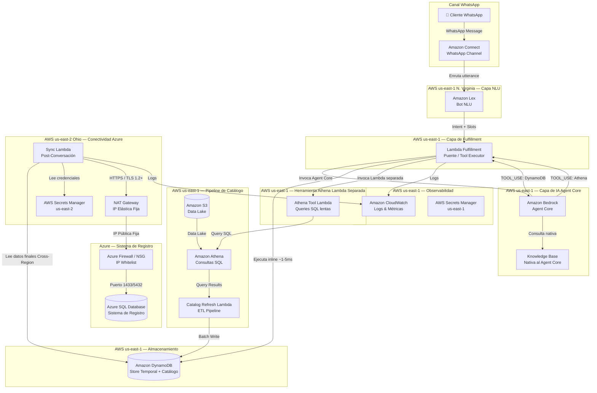
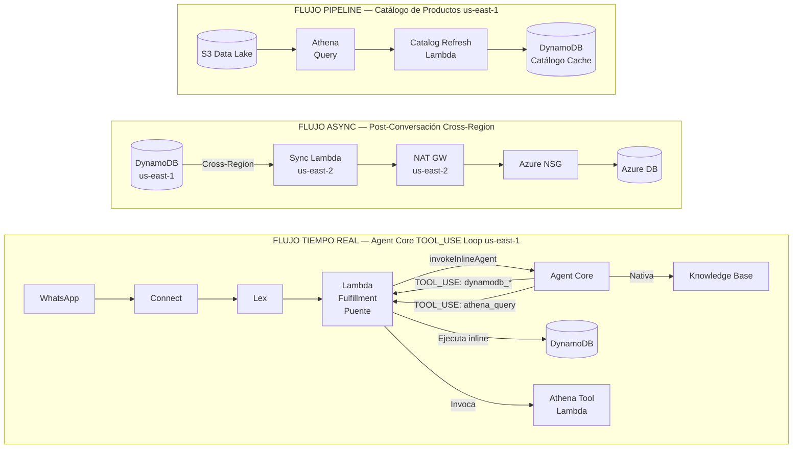
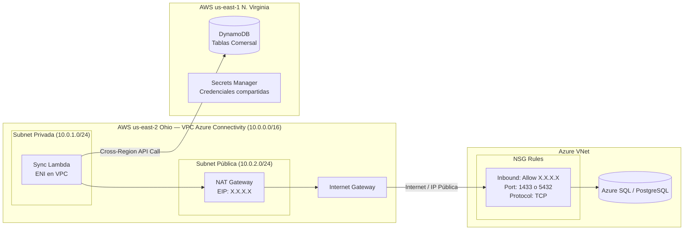
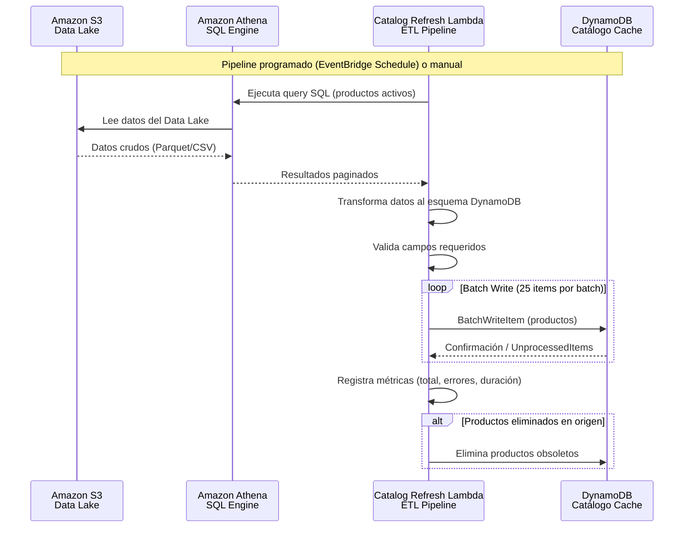
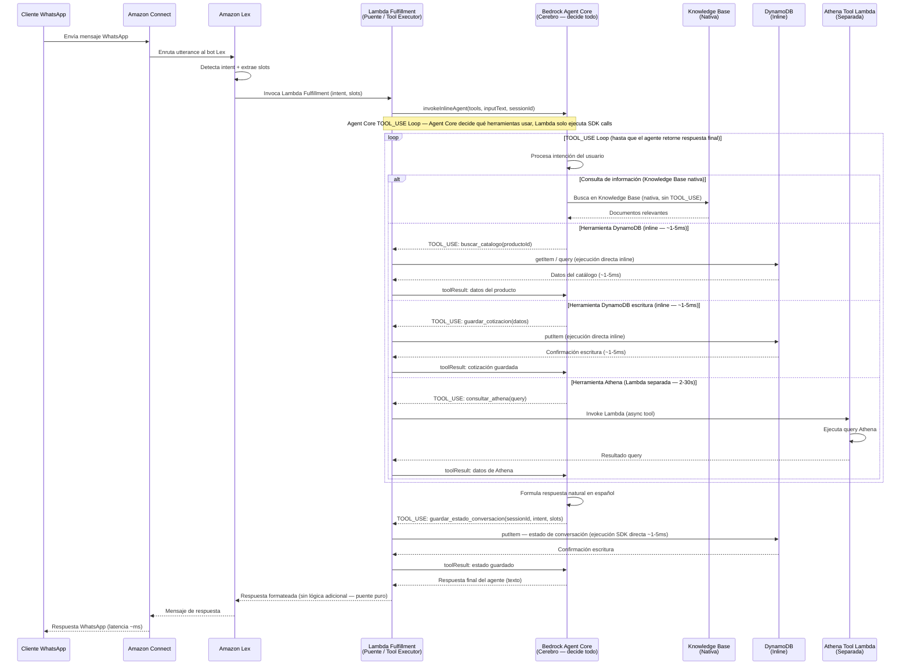
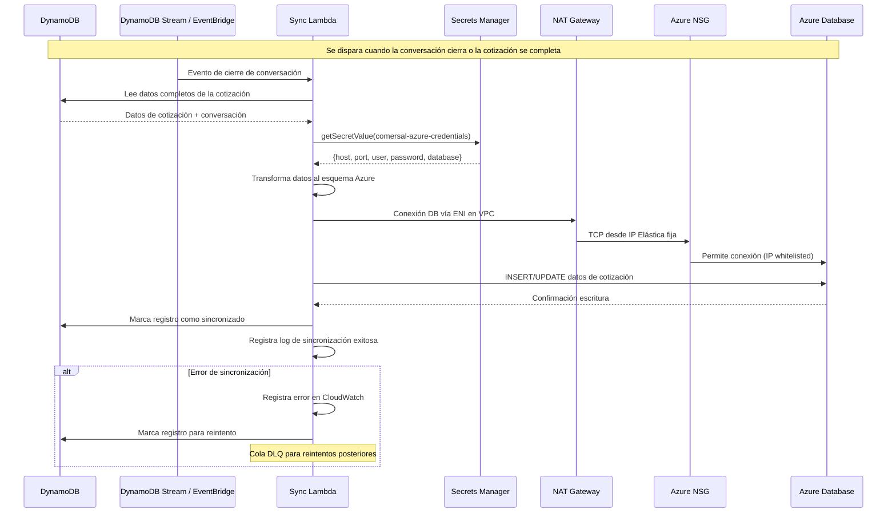

# Documento de Diseño: Asistente WhatsApp con Integración Multi-Cloud — Cliente Comersal

## Descripción General

Esta es una solución de asistente conversacional vía WhatsApp diseñada para el cliente **Comersal**, que permite a sus usuarios realizar consultas y cotizaciones a través de una arquitectura multi-cloud (AWS + Azure) y multi-región. El canal de entrada es WhatsApp, gestionado por Amazon Connect, que requiere latencia cercana a cero en las respuestas. La arquitectura utiliza Amazon Lex como capa de NLU (Natural Language Understanding) entre Connect y la lógica de negocio, delegando el procesamiento inteligente a un **Amazon Bedrock Agent Core (AgentCore API / inline agents)** que orquesta herramientas inline y consultas a Knowledge Bases.

**Arquitectura Agent Core con herramientas inline**: A diferencia de un Bedrock Agent clásico con Action Groups (que invoca Lambdas separadas por cada herramienta), Agent Core define las herramientas programáticamente en la invocación. Cuando el agente decide usar una herramienta, retorna un `TOOL_USE` al caller (Lambda Fulfillment). La Lambda Fulfillment — que actúa exclusivamente como **puente/conector** entre Lex y Agent Core — ejecuta la llamada SDK correspondiente y retorna el resultado al agente en el mismo ciclo de invocación. La Lambda Fulfillment NO contiene lógica de negocio ni toma decisiones de orquestación; simplemente ejecuta lo que el Agent Core le pide vía TOOL_USE. Esto elimina el overhead de Lambda-a-Lambda para la mayoría de operaciones.

**Tipos de herramientas por latencia**:
- **DynamoDB (inline)**: Cuando Agent Core retorna `TOOL_USE` para una herramienta DynamoDB, la Lambda Fulfillment ejecuta la operación SDK (`dynamodb.getItem()`, `dynamodb.putItem()`, etc.) directamente (~1-5ms). Sin Lambda separada.
- **Athena (Lambda separada)**: Cuando Agent Core retorna `TOOL_USE` para Athena, la Lambda Fulfillment ejecuta `lambda.invoke(athenaToolLambdaArn)` vía SDK para delegar a una Lambda dedicada, porque las queries pueden tomar 2-30 segundos.
- **Knowledge Base (nativa)**: Conectada directamente al Agent Core, sin TOOL_USE ni Lambda necesaria.

El diseño separa tres flujos de datos fundamentales: (1) un flujo en tiempo real durante la conversación activa (WhatsApp → Connect → Lex → Lambda Fulfillment (puente) → Agent Core → TOOL_USE loop → KB/DynamoDB inline) optimizado para latencia mínima, (2) un flujo asíncrono post-conversación (DynamoDB → Sync Lambda → Azure DB) que sincroniza los datos al sistema de registro en Azure, y (3) un flujo de pipeline de datos de catálogo (Amazon Athena → S3 → Transform → DynamoDB) que alimenta la tabla de caché de catálogo con datos de productos extraídos desde Athena. DynamoDB actúa como almacenamiento temporal de alta velocidad durante las conversaciones, mientras que Azure DB es el sistema de registro definitivo que se actualiza de forma asíncrona.

**Modelo mental clave**: La Lambda Fulfillment es un **puente puro** (bridge/tool executor) entre Lex y Agent Core. No tiene lógica de negocio propia. Su ciclo de vida es: (1) recibe evento de Lex, (2) llama `invokeInlineAgent` en Agent Core, (3) ejecuta el loop TOOL_USE despachando llamadas SDK según lo que Agent Core solicite, (4) retorna la respuesta final del agente a Lex. El Agent Core es el cerebro que decide todo — incluyendo cuándo guardar estado de conversación (vía herramienta `guardar_estado_conversacion`).

La infraestructura se despliega en dos regiones de AWS: **us-east-1 (N. Virginia)** aloja el 90% de los componentes — Amazon Connect, Lex, Lambda Fulfillment (con herramientas DynamoDB inline), Bedrock Agent Core, Knowledge Base, DynamoDB, CloudWatch — mientras que **us-east-2 (Ohio)** aloja exclusivamente los componentes de conectividad con Azure — Sync Lambda, VPC, NAT Gateway, EIP — debido a la mejor latencia desde Ohio hacia Azure.

Este documento cubre la arquitectura de infraestructura multi-región, los flujos de datos en tiempo real (con el modelo TOOL_USE de Agent Core), asíncronos y de pipeline de catálogo, la capa de aplicación (Lambda functions, Lex intents, Agent Core tool definitions) y las consideraciones de seguridad, rendimiento y escalabilidad para cumplir con el requisito de latencia cercana a cero en el canal WhatsApp.

## Arquitectura

### Diagrama de Arquitectura General (Multi-Región)



### Diagrama de Flujos de Datos



### Diagrama de Red — Sincronización Cross-Cloud (Multi-Región)



### Diagrama de Pipeline de Catálogo — Athena → DynamoDB (us-east-1)



## Diagramas de Secuencia

### Flujo Tiempo Real — Conversación WhatsApp (Cotización con Agent Core TOOL_USE — Lambda Puente)



### Flujo Asíncrono — Sincronización Post-Conversación



## Componentes e Interfaces

### Componente 1: Amazon Connect — Canal WhatsApp

**Propósito**: Punto de entrada del cliente vía WhatsApp. Gestiona el canal de mensajería y enruta la conversación al bot Lex. Requiere latencia cercana a cero en las respuestas.

**Interfaz**:
```pascal
ESTRUCTURA ConnectWhatsAppConfig
  nombre: String              -- "Comersal-WhatsApp-Flow"
  canal: Enum(WHATSAPP)
  lexBotId: String            -- ID del bot Lex asociado
  lexBotAliasId: String       -- Alias del bot Lex
  idleTimeout: Integer        -- Segundos de inactividad (300)
  locale: String              -- "es-419" (Español Latinoamérica)
FIN ESTRUCTURA
```

**Responsabilidades**:
- Recibir mensajes entrantes de WhatsApp
- Enrutar al bot Lex mediante bloque de integración
- Manejar timeouts y desconexiones
- Transferir a agente humano si el bot no puede resolver
- Garantizar latencia mínima en el canal

### Componente 2: Amazon Lex — Bot NLU

**Propósito**: Capa de comprensión de lenguaje natural (NLU) entre Amazon Connect y la Lambda de Fulfillment. Detecta intenciones y extrae slots de los mensajes del usuario.

**Interfaz**:
```pascal
ESTRUCTURA LexBotConfig
  botName: String              -- "comersal-whatsapp-bot"
  locale: String               -- "es_419"
  intents: Lista(LexIntent)
  fulfillmentLambdaArn: String -- ARN de la Lambda Fulfillment
  idleSessionTTL: Integer      -- Segundos (300)
FIN ESTRUCTURA

ESTRUCTURA LexIntent
  nombre: String               -- "CotizarProducto", "ConsultarInfo", "Fallback"
  descripcion: String
  sampleUtterances: Lista(String)
  slots: Lista(LexSlot)
  fulfillmentType: Enum(LAMBDA, CLOSE)
FIN ESTRUCTURA

ESTRUCTURA LexSlot
  nombre: String               -- "producto", "cantidad", "cliente"
  tipo: String                 -- "AMAZON.AlphaNumeric", custom slot type
  obligatorio: Boolean
  promptMessage: String        -- Mensaje para solicitar el slot
FIN ESTRUCTURA
```

**Responsabilidades**:
- Detectar intenciones del usuario (cotizar, consultar, FAQ)
- Extraer slots relevantes (producto, cantidad, cliente)
- Manejar diálogos de confirmación y elicitación de slots
- Invocar Lambda Fulfillment con intent y slots resueltos
- Manejar intent de Fallback para mensajes no reconocidos

### Componente 3: Lambda Fulfillment — Puente / Tool Executor (Bridge)

**Propósito**: Función Lambda invocada por Lex que actúa exclusivamente como **puente (bridge)** entre Lex y el Bedrock Agent Core. NO contiene lógica de negocio ni toma decisiones de orquestación. Su único rol es: (1) recibir el evento de Lex, (2) invocar Agent Core con `invokeInlineAgent`, (3) manejar el loop de `TOOL_USE` ejecutando llamadas SDK según lo que Agent Core solicite (DynamoDB directo ~1-5ms, o `lambda.invoke()` para Athena), y (4) retornar la respuesta final del agente a Lex. El Agent Core es quien decide qué herramientas usar y cuándo — incluyendo guardar estado de conversación, que es una herramienta más que Agent Core invoca vía TOOL_USE.

**Interfaz**:
```pascal
ESTRUCTURA FulfillmentLambdaConfig
  functionName: String         -- "comersal-fulfillment"
  runtime: String              -- "python3.12" o "nodejs20.x"
  timeout: Integer             -- 30 segundos
  memorySize: Integer          -- 512 MB
  environment: Mapa(String, String)
    -- AGENT_FOUNDATION_MODEL: Modelo del Agent Core (ej. "anthropic.claude-3-sonnet")
    -- AGENT_INSTRUCTION: Prompt del agente (o S3 URI)
    -- KB_ID: ID de la Knowledge Base
    -- CONVERSATIONS_TABLE: Nombre tabla DynamoDB conversaciones
    -- COTIZACIONES_TABLE: Nombre tabla DynamoDB cotizaciones
    -- CATALOGO_TABLE: Nombre tabla DynamoDB catálogo cache
    -- ATHENA_TOOL_LAMBDA_ARN: ARN de la Lambda de herramienta Athena
FIN ESTRUCTURA

ESTRUCTURA LexFulfillmentEvent
  sessionId: String
  intentName: String
  slots: Mapa(String, SlotValue)
  inputTranscript: String      -- Mensaje original del usuario
  sessionAttributes: Mapa(String, String)
FIN ESTRUCTURA

ESTRUCTURA LexFulfillmentResponse
  sessionState: SessionState
  messages: Lista(Message)
FIN ESTRUCTURA

ESTRUCTURA SessionState
  dialogAction: DialogAction
  intent: IntentResult
  sessionAttributes: Mapa(String, String)
FIN ESTRUCTURA

-- Definición de herramientas inline para Agent Core
ESTRUCTURA InlineToolDefinition
  nombre: String               -- "buscar_catalogo", "guardar_cotizacion", etc.
  descripcion: String          -- Descripción para el agente
  parametros: JsonSchema        -- Schema JSON de los parámetros
FIN ESTRUCTURA

-- Evento TOOL_USE retornado por Agent Core
ESTRUCTURA ToolUseEvent
  toolUseId: String            -- ID único del uso de herramienta
  toolName: String             -- Nombre de la herramienta solicitada
  input: Mapa(String, Any)     -- Parámetros de la herramienta
FIN ESTRUCTURA

-- Resultado de herramienta para retornar al Agent Core
ESTRUCTURA ToolResult
  toolUseId: String            -- Mismo ID del ToolUseEvent
  content: String              -- Resultado serializado (JSON)
  status: Enum(SUCCESS, ERROR) -- Estado de la ejecución
FIN ESTRUCTURA
```

**Responsabilidades**:
- Recibir eventos de Lex con intent y slots
- Definir herramientas inline programáticamente para Agent Core
- Invocar Agent Core con `invokeInlineAgent` (tools + inputText + sessionId)
- Manejar el loop de TOOL_USE: recibir solicitudes de herramientas del agente, ejecutar la llamada SDK correspondiente y retornar resultados
- Para herramientas DynamoDB: ejecutar `dynamodb.getItem()`, `dynamodb.putItem()`, `dynamodb.query()`, etc. directamente vía SDK (~1-5ms)
- Para herramienta Athena: ejecutar `lambda.invoke(athenaToolLambdaArn)` vía SDK para delegar a Lambda separada
- Formatear respuesta final del agente para Lex/Connect/WhatsApp
- Manejar errores y retornar respuestas de fallback
- **NO tiene lógica de negocio propia** — solo ejecuta lo que Agent Core solicita vía TOOL_USE
- **NO decide qué herramientas usar** — eso lo decide Agent Core
- **NO gestiona estado de conversación por su cuenta** — el guardado de estado es una herramienta más que Agent Core invoca

### Componente 4: Amazon Bedrock Agent Core — Motor de IA con Herramientas Inline

**Propósito**: Motor de IA conversacional basado en la API AgentCore (inline agents). Es el **cerebro** del sistema — interpreta la intención del usuario, decide qué herramientas usar (incluyendo cuándo guardar estado de conversación), y retorna `TOOL_USE` events al caller (Lambda Fulfillment) para que ejecute las llamadas SDK. La Lambda Fulfillment es solo un puente que ejecuta lo que Agent Core pide. La Knowledge Base está conectada nativamente al Agent Core. Las herramientas se definen programáticamente en cada invocación — no hay Action Groups ni Lambdas separadas para DynamoDB.

**Interfaz**:
```pascal
ESTRUCTURA AgentCoreConfig
  foundationModel: String          -- "anthropic.claude-3-sonnet" o similar
  instruction: Text                -- Prompt del agente (instrucciones de comportamiento)
  knowledgeBases: Lista(KBConfig)  -- Knowledge Bases conectadas nativamente
  idleSessionTTL: Integer          -- Segundos (1800)
FIN ESTRUCTURA

-- Las herramientas se definen programáticamente en la invocación
ESTRUCTURA AgentCoreToolDefinition
  toolSpec: ToolSpec
FIN ESTRUCTURA

ESTRUCTURA ToolSpec
  nombre: String                   -- "buscar_catalogo", "guardar_cotizacion", "consultar_athena"
  descripcion: String              -- Descripción para que el agente decida cuándo usarla
  inputSchema: JsonSchema           -- Schema JSON de los parámetros de entrada
FIN ESTRUCTURA

ESTRUCTURA KBConfig
  knowledgeBaseId: String
  descripcion: String              -- Descripción para el agente
  retrievalConfig: RetrievalConfig
FIN ESTRUCTURA

-- Herramientas definidas para Comersal Agent Core
ESTRUCTURA ComersalToolDefinitions
  -- Herramienta 1: Buscar producto en catálogo (DynamoDB inline)
  buscarCatalogo: ToolSpec
    nombre: "buscar_catalogo"
    descripcion: "Busca un producto en el catálogo por ID o nombre. Retorna precio, disponibilidad y detalles."
    inputSchema: {
      productoId: String (opcional),
      nombreBusqueda: String (opcional),
      categoria: String (opcional)
    }

  -- Herramienta 2: Guardar cotización (DynamoDB inline)
  guardarCotizacion: ToolSpec
    nombre: "guardar_cotizacion"
    descripcion: "Guarda o actualiza una cotización con los productos y cantidades especificados."
    inputSchema: {
      sessionId: String,
      cliente: String,
      productos: Lista({productoId: String, cantidad: Integer})
    }

  -- Herramienta 3: Leer cotización existente (DynamoDB inline)
  leerCotizacion: ToolSpec
    nombre: "leer_cotizacion"
    descripcion: "Lee una cotización existente por su ID o por sessionId."
    inputSchema: {
      cotizacionId: String (opcional),
      sessionId: String (opcional)
    }

  -- Herramienta 4: Consultar datos vía Athena (Lambda separada)
  consultarAthena: ToolSpec
    nombre: "consultar_athena"
    descripcion: "Ejecuta una consulta SQL sobre el Data Lake para obtener datos de productos, inventario o estadísticas. Usar solo cuando los datos no están en el catálogo DynamoDB."
    inputSchema: {
      query: String,
      maxResultados: Integer (opcional, default 100)
    }

  -- Herramienta 5: Guardar estado de conversación (DynamoDB inline)
  guardarEstadoConversacion: ToolSpec
    nombre: "guardar_estado_conversacion"
    descripcion: "Guarda el estado actual de la conversación en DynamoDB para mantener contexto entre turnos."
    inputSchema: {
      sessionId: String,
      intentName: String,
      slots: Mapa(String, String) (opcional),
      resumenConversacion: String (opcional)
    }
FIN ESTRUCTURA
```

**Responsabilidades**:
- Interpretar intenciones del usuario en español
- Decidir qué herramientas usar basándose en las definiciones de tools — **es el único componente que toma decisiones**
- Retornar `TOOL_USE` events al caller (Lambda Fulfillment) cuando necesita ejecutar una herramienta
- Recibir `toolResult` del caller y continuar el razonamiento
- Puede llamar múltiples herramientas en secuencia (loop) antes de dar respuesta final
- Consultar Knowledge Base nativamente (sin TOOL_USE) para preguntas documentales
- Decidir cuándo guardar estado de conversación (vía herramienta `guardar_estado_conversacion`)
- Formular respuestas naturales con los datos obtenidos de las herramientas
- Mantener contexto de la conversación entre turnos

**Flujo TOOL_USE**:
```pascal
-- Ciclo de vida de una invocación Agent Core
-- 1. Lambda Fulfillment (puente) llama invokeInlineAgent(tools, inputText, sessionId)
-- 2. Agent Core (cerebro) procesa y decide si necesita herramientas
-- 3. Si necesita herramienta: retorna TOOL_USE event con toolName + input
-- 4. Lambda Fulfillment (puente) ejecuta la llamada SDK correspondiente:
--    - DynamoDB tools: dynamodb.getItem(), dynamodb.putItem(), etc. (~1-5ms)
--    - Athena tool: lambda.invoke(athenaToolLambdaArn) (2-30s)
-- 5. Lambda Fulfillment retorna toolResult al Agent Core
-- 6. Agent Core puede pedir más herramientas (vuelve a paso 3) o dar respuesta final
-- 7. Cuando termina: retorna texto de respuesta final
-- NOTA: La Lambda Fulfillment NO decide nada — solo ejecuta lo que Agent Core pide
```

### Componente 5: Amazon DynamoDB — Almacenamiento Temporal

**Propósito**: Base de datos NoSQL de alta velocidad que sirve como almacenamiento temporal durante conversaciones activas. Almacena cotizaciones en progreso, estado de conversación y datos de catálogo para lectura rápida.

**Interfaz**:
```pascal
ESTRUCTURA DynamoDBTablas
  conversaciones: TablaConfig
  cotizaciones: TablaConfig
  catalogoCache: TablaConfig
FIN ESTRUCTURA

ESTRUCTURA TablaConfig
  tableName: String
  partitionKey: String
  sortKey: String
  ttl: TTLConfig
  gsi: Lista(GSIConfig)
FIN ESTRUCTURA

-- Tabla: comersal-conversaciones
ESTRUCTURA ConversacionItem
  sessionId: String            -- PK: ID de sesión Connect/Lex
  timestamp: String            -- SK: ISO 8601
  intentName: String
  slots: Mapa(String, String)
  agentResponse: String
  estado: Enum(ACTIVA, CERRADA, SINCRONIZADA)
  ttl: Integer                 -- Epoch seconds (expiración automática)
FIN ESTRUCTURA

-- Tabla: comersal-cotizaciones
ESTRUCTURA CotizacionItem
  cotizacionId: String         -- PK: UUID
  sessionId: String            -- GSI: para buscar por sesión
  cliente: String
  productos: Lista(ProductoCotizado)
  total: Decimal
  estado: Enum(EN_PROGRESO, COMPLETADA, SINCRONIZADA, ERROR_SYNC)
  creadoEn: String             -- ISO 8601
  sincronizadoEn: String       -- ISO 8601 (null si no sincronizado)
  ttl: Integer                 -- Epoch seconds
FIN ESTRUCTURA

ESTRUCTURA ProductoCotizado
  productoId: String
  nombre: String
  cantidad: Integer
  precioUnitario: Decimal
  subtotal: Decimal
FIN ESTRUCTURA
```

**Responsabilidades**:
- Almacenar estado de conversaciones activas (lectura/escritura ~ms)
- Almacenar cotizaciones en progreso y completadas
- Servir como caché de catálogo para lecturas rápidas
- Expirar datos automáticamente vía TTL
- Proveer datos para sincronización asíncrona a Azure

### Componente 6: Lambda Sync — Sincronización Post-Conversación (us-east-2 Ohio)

**Propósito**: Función Lambda desplegada en **us-east-2 (Ohio)** que se ejecuta de forma asíncrona después de que una conversación cierra o una cotización se completa. Lee datos de DynamoDB en us-east-1 (cross-region) y los sincroniza al sistema de registro en Azure DB. Se despliega en Ohio por la mejor latencia hacia Azure.

**Interfaz**:
```pascal
ESTRUCTURA SyncLambdaConfig
  functionName: String         -- "comersal-sync-azure"
  region: String               -- "us-east-2" (Ohio)
  runtime: String              -- "python3.12" o "nodejs20.x"
  timeout: Integer             -- 60 segundos
  memorySize: Integer          -- 256 MB
  vpcConfig: VpcConfig         -- VPC en us-east-2 para NAT Gateway
  environment: Mapa(String, String)
    -- SECRET_ARN: ARN del secreto en us-east-2 Secrets Manager
    -- COTIZACIONES_TABLE: Nombre tabla DynamoDB (us-east-1)
    -- CONVERSACIONES_TABLE: Nombre tabla DynamoDB (us-east-1)
    -- DYNAMODB_REGION: "us-east-1" (región de DynamoDB, cross-region)
FIN ESTRUCTURA

ESTRUCTURA VpcConfig
  subnetIds: Lista(String)     -- Subnets privadas en us-east-2
  securityGroupIds: Lista(String)
FIN ESTRUCTURA

ESTRUCTURA SyncEvent
  tipo: Enum(COTIZACION_COMPLETADA, CONVERSACION_CERRADA)
  cotizacionId: String         -- Si aplica
  sessionId: String
  timestamp: String
FIN ESTRUCTURA

ESTRUCTURA SyncResult
  exitoso: Boolean
  registrosSincronizados: Integer
  errores: Lista(SyncError)
FIN ESTRUCTURA
```

**Responsabilidades**:
- Escuchar eventos de cierre de conversación / cotización completada
- Leer datos completos de DynamoDB en us-east-1 (acceso cross-region)
- Transformar datos al esquema de Azure DB
- Conectarse a Azure DB vía NAT Gateway en us-east-2 (TLS 1.2+)
- Escribir datos en Azure DB (INSERT/UPDATE)
- Marcar registros como sincronizados en DynamoDB (cross-region)
- Manejar errores con reintentos y DLQ
- Registrar logs de sincronización en CloudWatch (us-east-2)

**Nota Cross-Region**: La Sync Lambda en us-east-2 accede a DynamoDB en us-east-1 usando el SDK de AWS con la región explícita (`region_name='us-east-1'`). Esto agrega ~10-20ms de latencia por llamada, aceptable para el flujo asíncrono. Secrets Manager se usa localmente en us-east-2 para minimizar latencia en la obtención de credenciales.

### Componente 7: AWS Secrets Manager — Gestión de Credenciales

**Propósito**: Almacena de forma segura las credenciales de conexión a la base de datos Azure. Se despliega en **us-east-2 (Ohio)** donde reside la Sync Lambda para acceso local de baja latencia.

**Interfaz**:
```pascal
ESTRUCTURA SecretPayload
  host: String                 -- "comersal-db.database.windows.net" o similar
  port: Integer                -- 1433 (SQL Server) o 5432 (PostgreSQL)
  username: String
  password: String
  database: String
  ssl: Boolean                 -- true (siempre)
  engine: String               -- "sqlserver" o "postgresql"
FIN ESTRUCTURA
```

### Componente 8: Amazon Athena — Fuente de Datos de Catálogo (us-east-1)

**Propósito**: Motor de consultas SQL serverless que extrae datos de productos del Data Lake en S3. Se usa de dos formas: (1) como herramienta del Agent Core vía Athena Tool Lambda para consultas bajo demanda durante conversaciones, y (2) como fuente del pipeline de refresco de catálogo que carga datos en la tabla de caché DynamoDB. Sigue el patrón establecido en el proyecto `almacenes-bou/kb-loader` con `athena_extractor.py`.

**Interfaz**:
```pascal
ESTRUCTURA AthenaConfig
  database: String             -- "comersal_catalog_db"
  workgroup: String            -- "comersal-catalog-workgroup"
  queryOutputLocation: String  -- "s3://comersal-athena-results/"
  region: String               -- "us-east-1"
  queryTimeout: Integer        -- 300 segundos
FIN ESTRUCTURA

ESTRUCTURA AthenaQueryConfig
  batchSize: Integer           -- 500 (registros por batch con ROW_NUMBER)
  filtrosBase: FiltrosProducto
FIN ESTRUCTURA

ESTRUCTURA FiltrosProducto
  estatusActivo: Boolean       -- Solo productos activos
  inventarioMinimo: Integer    -- Inventario > 0
  precioMinimo: Decimal        -- Precio > 0
FIN ESTRUCTURA

ESTRUCTURA AthenaQueryResult
  registros: Lista(ProductoCatalogo)
  totalRegistros: Integer
  queryExecutionId: String
  duracionMs: Integer
FIN ESTRUCTURA

ESTRUCTURA ProductoCatalogo
  productoId: String
  nombre: String
  departamento: String
  linea: String
  marca: String
  tipoProducto: String
  unidadMedida: String
  caracteristicas: String
  categoria: String
  precioUnitario: Decimal
FIN ESTRUCTURA
```

**Responsabilidades**:
- Ejecutar consultas SQL sobre datos en S3 (Data Lake)
- Extraer productos activos con filtros de negocio (estatus, inventario, precio)
- Paginar resultados usando ROW_NUMBER() para batches controlados
- Proveer datos crudos al pipeline de transformación
- Almacenar resultados de queries en S3 para auditoría

### Componente 9: Athena Tool Lambda — Herramienta Agent Core para Consultas SQL (us-east-1)

**Propósito**: Función Lambda dedicada que ejecuta consultas Athena bajo demanda cuando el Agent Core solicita la herramienta `consultar_athena` vía TOOL_USE. Se separa de la Lambda Fulfillment porque las queries de Athena pueden tomar 2-30 segundos y no deben bloquear el flujo principal. La Lambda Fulfillment invoca esta Lambda cuando recibe un TOOL_USE de tipo `consultar_athena`.

**Interfaz**:
```pascal
ESTRUCTURA AthenaToolLambdaConfig
  functionName: String         -- "comersal-athena-tool"
  region: String               -- "us-east-1"
  runtime: String              -- "python3.12" o "nodejs20.x"
  timeout: Integer             -- 60 segundos (queries pueden tardar)
  memorySize: Integer          -- 512 MB
  environment: Mapa(String, String)
    -- ATHENA_DATABASE: Nombre de la base de datos Athena
    -- ATHENA_QUERY_OUTPUT: S3 URI para resultados de queries
    -- ATHENA_TIMEOUT: Timeout para queries (default 30s)
FIN ESTRUCTURA

ESTRUCTURA AthenaToolEvent
  query: String                -- Query SQL a ejecutar
  maxResultados: Integer       -- Máximo de resultados (default 100)
FIN ESTRUCTURA

ESTRUCTURA AthenaToolResponse
  exitoso: Boolean
  registros: Lista(Mapa)
  totalRegistros: Integer
  duracionMs: Integer
  error: String                -- Si hubo error
FIN ESTRUCTURA
```

**Responsabilidades**:
- Recibir queries SQL del dispatcher de herramientas (Lambda Fulfillment)
- Ejecutar queries en Athena con timeout controlado
- Paginar y retornar resultados al caller
- Manejar errores de Athena (timeout, query inválida, permisos)
- Registrar métricas de ejecución

### Componente 10: Catalog Refresh Lambda — Pipeline ETL (us-east-1)

**Propósito**: Función Lambda que orquesta el pipeline de refresco de catálogo: consulta Athena, transforma los datos y los carga en DynamoDB mediante batch writes. Se ejecuta de forma programada (EventBridge Schedule) o bajo demanda.

**Interfaz**:
```pascal
ESTRUCTURA CatalogRefreshLambdaConfig
  functionName: String         -- "comersal-catalog-refresh"
  region: String               -- "us-east-1"
  runtime: String              -- "python3.12"
  timeout: Integer             -- 900 segundos (15 min, máximo Lambda)
  memorySize: Integer          -- 1024 MB
  environment: Mapa(String, String)
    -- ATHENA_DATABASE: Nombre de la base de datos Athena
    -- ATHENA_QUERY_OUTPUT: S3 URI para resultados de queries
    -- CATALOGO_TABLE: Nombre tabla DynamoDB catálogo cache
    -- BATCH_SIZE: Tamaño de batch para Athena (default 500)
    -- DDB_BATCH_SIZE: Tamaño de batch para DynamoDB writes (max 25)
FIN ESTRUCTURA

ESTRUCTURA CatalogRefreshEvent
  tipo: Enum(SCHEDULED, MANUAL, PARTIAL)
  filtroCategoria: String      -- Opcional: refrescar solo una categoría
  forzarRefresco: Boolean      -- Ignorar timestamp de último refresco
FIN ESTRUCTURA

ESTRUCTURA CatalogRefreshResult
  exitoso: Boolean
  productosExtraidos: Integer
  productosEscritos: Integer
  productosEliminados: Integer
  errores: Lista(String)
  duracionSegundos: Decimal
  timestampRefresco: String    -- ISO 8601
FIN ESTRUCTURA
```

**Responsabilidades**:
- Ejecutar queries en Athena para extraer productos activos (en batches con ROW_NUMBER)
- Transformar datos crudos de Athena al esquema de DynamoDB
- Escribir productos en DynamoDB usando BatchWriteItem (25 items por batch)
- Manejar UnprocessedItems con reintentos y backoff exponencial
- Eliminar productos obsoletos que ya no existen en la fuente Athena
- Registrar métricas de ejecución (total extraído, escrito, errores, duración)
- Actualizar timestamp de último refresco exitoso

### Componente 11: Azure Database — Sistema de Registro

**Propósito**: Base de datos relacional en Azure que es el sistema de registro definitivo. Se actualiza de forma asíncrona desde DynamoDB después de que las conversaciones cierran.

**Interfaz**:
```pascal
ESTRUCTURA AzureDbConfig
  serverName: String           -- "comersal-db"
  resourceGroup: String
  tipo: Enum(SQL_SERVER, POSTGRESQL_FLEXIBLE)
  sku: String                  -- Tier de rendimiento
  publicNetworkAccess: Boolean -- true (acceso por IP pública)
  firewallRules: Lista(FirewallRule)
  tlsVersion: String           -- "1.2" mínimo
FIN ESTRUCTURA

ESTRUCTURA FirewallRule
  nombre: String               -- "allow-aws-nat-gateway"
  startIpAddress: String       -- IP del NAT Gateway AWS
  endIpAddress: String         -- Misma IP (rango de 1)
FIN ESTRUCTURA
```

## Modelos de Datos

### Modelo 1: CotizacionRequest — Solicitud de Cotización (Tiempo Real)

```pascal
ESTRUCTURA CotizacionRequest
  sessionId: String            -- ID de sesión Connect/Lex
  cliente: String              -- Nombre o ID del cliente
  productos: Lista(ProductoSolicitado)
FIN ESTRUCTURA

ESTRUCTURA ProductoSolicitado
  productoId: String
  cantidad: Integer
FIN ESTRUCTURA
```

**Reglas de Validación**:
- `sessionId` no puede ser vacío ni nulo
- `cliente` no puede ser vacío
- `productos` debe tener al menos 1 elemento
- `cantidad` debe ser mayor a 0

### Modelo 2: CotizacionResponse — Respuesta de Cotización

```pascal
ESTRUCTURA CotizacionResponse
  success: Boolean
  cotizacionId: String         -- UUID generado
  productos: Lista(ProductoCotizado)
  total: Decimal
  metadata: CotizacionMetadata
FIN ESTRUCTURA

ESTRUCTURA CotizacionMetadata
  sessionId: String
  creadoEn: String             -- ISO 8601
  estado: String               -- "EN_PROGRESO" o "COMPLETADA"
  executionTimeMs: Integer
FIN ESTRUCTURA
```

### Modelo 3: SyncPayload — Datos para Sincronización a Azure

```pascal
ESTRUCTURA SyncPayload
  cotizacionId: String
  sessionId: String
  cliente: String
  productos: Lista(ProductoCotizado)
  total: Decimal
  creadoEn: String             -- ISO 8601
  completadoEn: String         -- ISO 8601
  conversacionResumen: String  -- Resumen de la conversación
FIN ESTRUCTURA
```

### Modelo 4: ErrorResponse — Respuesta de Error

```pascal
ESTRUCTURA ErrorResponse
  success: Boolean             -- Siempre false
  error: String                -- Descripción del error
  errorType: String            -- "ValidationError", "AgentError", "DynamoDBError", "SyncError"
  requestId: String
  hint: String                 -- Sugerencia para corregir (si aplica)
FIN ESTRUCTURA
```

### Modelo 5: HealthCheckResponse — Estado del Sistema

```pascal
ESTRUCTURA HealthCheckResponse
  status: String               -- "healthy" o "unhealthy"
  timestamp: String            -- ISO 8601
  version: String
  components: Mapa(String, ComponentHealth)
FIN ESTRUCTURA

ESTRUCTURA ComponentHealth
  status: String               -- "up" o "down"
  latencyMs: Integer
  details: String
FIN ESTRUCTURA
```

## Pseudocódigo Algorítmico

### Algoritmo Principal: Fulfillment de Lex con Agent Core — Lambda Puente (Tiempo Real)

> **Nota importante**: La Lambda Fulfillment es un **puente puro** entre Lex y Agent Core. No tiene lógica de negocio. Su único trabajo es: recibir evento de Lex → invocar Agent Core → ejecutar el loop TOOL_USE (despachando llamadas SDK) → retornar respuesta a Lex. El Agent Core es quien decide todo, incluyendo cuándo guardar estado de conversación (vía herramienta `guardar_estado_conversacion`).

```pascal
ALGORITMO procesarFulfillment(evento)
ENTRADA: evento de tipo LexFulfillmentEvent
SALIDA: respuesta de tipo LexFulfillmentResponse

INICIO
  -- Paso 1: Extraer datos del evento Lex (sin lógica de negocio)
  sessionId ← evento.sessionId
  intentName ← evento.intentName
  slots ← evento.slots
  mensaje ← evento.inputTranscript

  -- Paso 2: Definir herramientas inline para Agent Core
  -- (La Lambda solo define las herramientas — Agent Core decide cuáles usar)
  toolDefinitions ← [
    {
      toolSpec: {
        nombre: "buscar_catalogo",
        descripcion: "Busca un producto en el catálogo por ID o nombre",
        inputSchema: {productoId: String, nombreBusqueda: String, categoria: String}
      }
    },
    {
      toolSpec: {
        nombre: "guardar_cotizacion",
        descripcion: "Guarda o actualiza una cotización con productos y cantidades",
        inputSchema: {sessionId: String, cliente: String, productos: Lista}
      }
    },
    {
      toolSpec: {
        nombre: "leer_cotizacion",
        descripcion: "Lee una cotización existente por ID o sessionId",
        inputSchema: {cotizacionId: String, sessionId: String}
      }
    },
    {
      toolSpec: {
        nombre: "consultar_athena",
        descripcion: "Consulta SQL sobre el Data Lake (usar solo si datos no están en catálogo)",
        inputSchema: {query: String, maxResultados: Integer}
      }
    },
    {
      toolSpec: {
        nombre: "guardar_estado_conversacion",
        descripcion: "Guarda el estado actual de la conversación para mantener contexto entre turnos",
        inputSchema: {sessionId: String, intentName: String, slots: Mapa, resumenConversacion: String}
      }
    }
  ]

  -- Paso 3: Invocar Agent Core (el cerebro que decide todo)
  INTENTAR
    contextoAgente ← construirContexto(intentName, slots, mensaje)

    agentStream ← bedrockAgentRuntime.invokeInlineAgent(
      foundationModel: AGENT_FOUNDATION_MODEL,
      instruction: AGENT_INSTRUCTION,
      inputText: contextoAgente,
      sessionId: sessionId,
      inlineSessionState: {knowledgeBases: [{knowledgeBaseId: KB_ID}]},
      actionGroups: [{
        actionGroupName: "comersal-tools",
        actionGroupExecutor: {customControl: "RETURN_CONTROL"},
        toolDefinitions: toolDefinitions
      }]
    )

    -- Paso 4: Loop TOOL_USE — la Lambda solo ejecuta llamadas SDK, no decide nada
    respuestaFinal ← ""

    PARA CADA chunk EN agentStream HACER
      -- Invariante: todas las herramientas previas fueron ejecutadas y sus resultados retornados

      SI chunk ES returnControlEvent ENTONCES
        -- Agent Core solicita ejecutar una herramienta
        -- La Lambda solo despacha la llamada SDK correspondiente
        toolUseId ← chunk.invocationId
        toolName ← chunk.actionName
        toolInput ← chunk.parameters

        toolResult ← ejecutarHerramienta(toolName, toolInput, sessionId)

        agentStream.enviarToolResult({
          toolUseId: toolUseId,
          content: serializarJSON(toolResult.data),
          status: toolResult.status
        })

      SINO SI chunk ES textChunk ENTONCES
        respuestaFinal ← respuestaFinal + chunk.texto
      FIN SI
    FIN PARA

  CAPTURAR errorAgente
    registrarLog("ERROR", "Fallo al invocar Agent Core", errorAgente)
    RETORNAR crearRespuestaFallback("Lo siento, tuve un problema procesando tu solicitud. ¿Podrías intentar de nuevo?")
  FIN INTENTAR

  -- Paso 5: Formatear respuesta para Lex (sin lógica adicional — puente puro)
  RETORNAR {
    sessionState: {
      dialogAction: {type: "Close"},
      intent: {name: intentName, state: "Fulfilled"}
    },
    messages: [{
      contentType: "PlainText",
      content: respuestaFinal
    }]
  }
FIN
```

**Precondiciones:**
- `evento` es un LexFulfillmentEvent válido proveniente de Amazon Lex
- AGENT_FOUNDATION_MODEL, AGENT_INSTRUCTION y KB_ID están definidos como variables de entorno
- La Lambda tiene permisos IAM para `bedrock:InvokeInlineAgent`, acceder a DynamoDB y invocar la Athena Tool Lambda
- Las tablas DynamoDB existen y están accesibles
- Las definiciones de herramientas son válidas y completas

**Postcondiciones:**
- Retorna un LexFulfillmentResponse válido para Amazon Lex
- Si exitoso: la respuesta contiene el texto final del agente (después de ejecutar todas las herramientas que Agent Core solicitó)
- Si error: la respuesta contiene un mensaje de fallback amigable
- La Lambda Fulfillment NO guardó estado por su cuenta — si Agent Core decidió guardar estado, lo hizo vía TOOL_USE
- Todas las herramientas solicitadas por el agente fueron ejecutadas y sus resultados retornados

**Invariantes de Bucle (TOOL_USE Loop):**
- Todas las herramientas previas fueron ejecutadas exitosamente y sus resultados retornados al Agent Core
- El agente puede solicitar 0 o más herramientas antes de dar respuesta final
- Cada TOOL_USE tiene un toolUseId único que se usa para correlacionar el resultado
- La Lambda Fulfillment nunca decide por sí misma qué herramienta ejecutar — solo despacha lo que Agent Core pide

### Algoritmo de Ejecución de Herramientas (SDK Dispatcher — sin lógica de negocio)

> **Nota**: Este dispatcher NO contiene lógica de negocio. Solo mapea el nombre de la herramienta solicitada por Agent Core a la llamada SDK correspondiente. Es un switch/case puro que ejecuta `dynamodb.getItem()`, `dynamodb.putItem()`, `lambda.invoke()`, etc.

```pascal
ALGORITMO ejecutarHerramienta(toolName, toolInput, sessionId)
ENTRADA: toolName de tipo String, toolInput de tipo Mapa, sessionId de tipo String
SALIDA: resultado de tipo ToolResult

INICIO
  SELECCIONAR toolName

    CASO "buscar_catalogo":
      -- Herramienta INLINE — DynamoDB directo (~1-5ms)
      INTENTAR
        SI toolInput.productoId NO ES NULO ENTONCES
          item ← dynamodb.getItem(
            tabla: CATALOGO_TABLE,
            key: {productoId: toolInput.productoId}
          )
        SINO SI toolInput.nombreBusqueda NO ES NULO ENTONCES
          items ← dynamodb.query(
            tabla: CATALOGO_TABLE,
            index: "nombre-index",
            keyCondition: "contains(nombre, :nombre)",
            values: {":nombre": toolInput.nombreBusqueda}
          )
          item ← items
        FIN SI

        RETORNAR {status: "SUCCESS", data: item}
      CAPTURAR error
        RETORNAR {status: "ERROR", data: {error: error.mensaje}}
      FIN INTENTAR

    CASO "guardar_cotizacion":
      -- Herramienta INLINE — DynamoDB directo (~1-5ms)
      INTENTAR
        -- Buscar precios de cada producto
        productosConPrecio ← []
        total ← 0

        PARA CADA prod EN toolInput.productos HACER
          catalogo ← dynamodb.getItem(
            tabla: CATALOGO_TABLE,
            key: {productoId: prod.productoId}
          )
          SI catalogo ES NULO ENTONCES
            RETORNAR {status: "ERROR", data: {error: "Producto no encontrado: " + prod.productoId}}
          FIN SI

          subtotal ← catalogo.precioUnitario * prod.cantidad
          productosConPrecio.agregar({
            productoId: prod.productoId,
            nombre: catalogo.nombre,
            cantidad: prod.cantidad,
            precioUnitario: catalogo.precioUnitario,
            subtotal: subtotal
          })
          total ← total + subtotal
        FIN PARA

        cotizacionId ← generarUUID()
        dynamodb.putItem(
          tabla: COTIZACIONES_TABLE,
          item: {
            cotizacionId: cotizacionId,
            sessionId: sessionId,
            cliente: toolInput.cliente,
            productos: productosConPrecio,
            total: total,
            estado: "EN_PROGRESO",
            creadoEn: obtenerTimestampISO(),
            ttl: calcularTTL(72)
          }
        )

        RETORNAR {status: "SUCCESS", data: {cotizacionId: cotizacionId, productos: productosConPrecio, total: total}}
      CAPTURAR error
        RETORNAR {status: "ERROR", data: {error: error.mensaje}}
      FIN INTENTAR

    CASO "leer_cotizacion":
      -- Herramienta INLINE — DynamoDB directo (~1-5ms)
      INTENTAR
        SI toolInput.cotizacionId NO ES NULO ENTONCES
          item ← dynamodb.getItem(
            tabla: COTIZACIONES_TABLE,
            key: {cotizacionId: toolInput.cotizacionId}
          )
        SINO SI toolInput.sessionId NO ES NULO ENTONCES
          items ← dynamodb.query(
            tabla: COTIZACIONES_TABLE,
            index: "sessionId-index",
            keyCondition: "sessionId = :sid",
            values: {":sid": toolInput.sessionId}
          )
          item ← items
        FIN SI

        RETORNAR {status: "SUCCESS", data: item}
      CAPTURAR error
        RETORNAR {status: "ERROR", data: {error: error.mensaje}}
      FIN INTENTAR

    CASO "consultar_athena":
      -- Herramienta LAMBDA SEPARADA — porque Athena puede tardar 2-30s
      -- La Lambda Fulfillment ejecuta lambda.invoke() vía SDK
      INTENTAR
        respuestaLambda ← lambda.invoke(
          functionName: ATHENA_TOOL_LAMBDA_ARN,
          payload: {query: toolInput.query, maxResultados: toolInput.maxResultados}
        )
        RETORNAR {status: "SUCCESS", data: respuestaLambda.payload}
      CAPTURAR error
        RETORNAR {status: "ERROR", data: {error: "Error consultando Athena: " + error.mensaje}}
      FIN INTENTAR

    CASO "guardar_estado_conversacion":
      -- Herramienta INLINE — DynamoDB directo (~1-5ms)
      -- Agent Core decide cuándo guardar estado; la Lambda solo ejecuta el SDK call
      INTENTAR
        dynamodb.putItem(
          tabla: CONVERSATIONS_TABLE,
          item: {
            sessionId: toolInput.sessionId,
            timestamp: obtenerTimestampISO(),
            intentName: toolInput.intentName,
            slots: toolInput.slots O {},
            resumenConversacion: toolInput.resumenConversacion O "",
            estado: "ACTIVA",
            ttl: calcularTTL(24)  -- Expira en 24 horas
          }
        )
        RETORNAR {status: "SUCCESS", data: {mensaje: "Estado de conversación guardado"}}
      CAPTURAR error
        RETORNAR {status: "ERROR", data: {error: "Error guardando estado: " + error.mensaje}}
      FIN INTENTAR

    DEFECTO:
      RETORNAR {status: "ERROR", data: {error: "Herramienta desconocida: " + toolName}}

  FIN SELECCIONAR
FIN
```

**Precondiciones:**
- `toolName` es uno de los nombres definidos en las herramientas del Agent Core
- `toolInput` contiene los parámetros requeridos según el schema de la herramienta
- Las tablas DynamoDB y la Athena Tool Lambda están accesibles

**Postcondiciones:**
- Retorna un ToolResult con status SUCCESS o ERROR
- Para herramientas DynamoDB (inline): latencia ~1-5ms, sin overhead de Lambda adicional
- Para herramienta Athena (Lambda separada): latencia 2-30s dependiendo de la query
- Nunca lanza excepciones — siempre retorna un resultado estructurado

### Algoritmo de Cotización (Ejecutado Inline vía TOOL_USE — DynamoDB directo)

> **Nota**: Este algoritmo ya no es una Lambda separada (Action Group). Se ejecuta directamente dentro de la Lambda Fulfillment como parte del dispatcher de herramientas cuando el Agent Core retorna `TOOL_USE: guardar_cotizacion`. La lógica detallada está en el `CASO "guardar_cotizacion"` del algoritmo `ejecutarHerramienta` arriba. A continuación se documenta la versión expandida con especificaciones formales.

```pascal
ALGORITMO procesarCotizacionInline(toolInput, sessionId)
ENTRADA: toolInput de tipo Mapa (parámetros de la herramienta guardar_cotizacion), sessionId de tipo String
SALIDA: resultado de tipo ToolResult

INICIO
  -- Paso 1: Extraer datos de cotización (del toolInput del Agent Core)
  cliente ← toolInput.cliente
  productos ← toolInput.productos

  -- Paso 2: Validar datos de entrada
  SI cliente ES NULO O productos ES VACÍO ENTONCES
    RETORNAR {status: "ERROR", data: {error: "Cliente y productos son requeridos"}}
  FIN SI

  -- Paso 3: Buscar precios en DynamoDB (lectura inline directa ~1-5ms por item)
  productosConPrecio ← []
  total ← 0

  PARA CADA prod EN productos HACER
    -- Invariante: todos los productos previos tienen precio válido
    INTENTAR
      catalogo ← dynamodb.getItem(
        tabla: CATALOGO_TABLE,
        key: {productoId: prod.productoId}
      )

      SI catalogo ES NULO ENTONCES
        RETORNAR {status: "ERROR", data: {error: "Producto no encontrado: " + prod.productoId}}
      FIN SI

      subtotal ← catalogo.precioUnitario * prod.cantidad
      productosConPrecio.agregar({
        productoId: prod.productoId,
        nombre: catalogo.nombre,
        cantidad: prod.cantidad,
        precioUnitario: catalogo.precioUnitario,
        subtotal: subtotal
      })
      total ← total + subtotal

    CAPTURAR errorDDB
      registrarLog("ERROR", "Error leyendo catálogo DynamoDB", errorDDB)
      RETORNAR {status: "ERROR", data: {error: "Error consultando catálogo"}}
    FIN INTENTAR
  FIN PARA

  -- Paso 4: Guardar cotización en DynamoDB (escritura inline directa ~1-5ms)
  cotizacionId ← generarUUID()

  dynamodb.putItem(
    tabla: COTIZACIONES_TABLE,
    item: {
      cotizacionId: cotizacionId,
      sessionId: sessionId,
      cliente: cliente,
      productos: productosConPrecio,
      total: total,
      estado: "EN_PROGRESO",
      creadoEn: obtenerTimestampISO(),
      ttl: calcularTTL(72)  -- Expira en 72 horas
    }
  )

  -- Paso 5: Retornar resultado al Agent Core (vía toolResult)
  RETORNAR {
    status: "SUCCESS",
    data: {
      cotizacionId: cotizacionId,
      productos: productosConPrecio,
      total: total,
      metadata: {
        sessionId: sessionId,
        creadoEn: obtenerTimestampISO(),
        estado: "EN_PROGRESO"
      }
    }
  }
FIN
```

**Precondiciones:**
- `toolInput` contiene los parámetros válidos de la herramienta `guardar_cotizacion` del Agent Core
- La tabla de catálogo en DynamoDB está poblada con productos y precios
- La Lambda Fulfillment tiene permisos de lectura/escritura en DynamoDB (misma Lambda, sin hop adicional)

**Postcondiciones:**
- Si exitoso: cotización guardada en DynamoDB con estado "EN_PROGRESO", resultado retornado al Agent Core
- Si producto no encontrado: retorna error al Agent Core (el agente puede informar al usuario)
- Si error de DynamoDB: retorna error al Agent Core
- El total es la suma correcta de todos los subtotales

**Invariantes de Bucle:**
- Todos los productos procesados previamente tienen precio válido
- `total` es la suma acumulada de subtotales de productos procesados

### Algoritmo de Sincronización Asíncrona (Post-Conversación — us-east-2 → Azure)

```pascal
ALGORITMO sincronizarAzure(evento)
ENTRADA: evento de tipo SyncEvent
SALIDA: resultado de tipo SyncResult

INICIO
  resultado ← NUEVO SyncResult
  resultado.exitoso ← VERDADERO
  resultado.registrosSincronizados ← 0
  resultado.errores ← []

  -- Nota: Esta Lambda corre en us-east-2 (Ohio)
  -- DynamoDB está en us-east-1 (N. Virginia) — acceso cross-region
  dynamodbCrossRegion ← crearClienteDynamoDB(region: "us-east-1")

  -- Paso 1: Leer datos de DynamoDB (cross-region us-east-1)
  INTENTAR
    cotizacion ← dynamodbCrossRegion.getItem(
      tabla: COTIZACIONES_TABLE,
      key: {cotizacionId: evento.cotizacionId}
    )

    SI cotizacion ES NULO ENTONCES
      LANZAR NuevoError("SyncError", "Cotización no encontrada: " + evento.cotizacionId)
    FIN SI

    SI cotizacion.estado = "SINCRONIZADA" ENTONCES
      registrarLog("INFO", "Cotización ya sincronizada, omitiendo")
      RETORNAR resultado
    FIN SI
  CAPTURAR errorLectura
    registrarLog("ERROR", "Error leyendo DynamoDB", errorLectura)
    LANZAR errorLectura
  FIN INTENTAR

  -- Paso 2: Obtener credenciales de Azure DB (local us-east-2)
  INTENTAR
    credenciales ← obtenerCredenciales(SECRET_ARN)  -- Secrets Manager local en us-east-2
  CAPTURAR errorSecret
    registrarLog("ERROR", "Fallo al obtener credenciales Azure", errorSecret)
    LANZAR errorSecret
  FIN INTENTAR

  -- Paso 3: Conectar a Azure DB vía NAT Gateway
  conexion ← NULO
  INTENTAR
    conexion ← crearConexionTLS(credenciales)

    -- Paso 4: Transformar y escribir datos
    payload ← transformarParaAzure(cotizacion)

    -- Iniciar transacción
    conexion.beginTransaction()

    -- Insertar/actualizar cotización
    conexion.ejecutar(
      "INSERT INTO cotizaciones (id, session_id, cliente, total, creado_en, completado_en) " +
      "VALUES (@id, @sessionId, @cliente, @total, @creadoEn, @completadoEn) " +
      "ON CONFLICT (id) DO UPDATE SET total = @total, completado_en = @completadoEn",
      payload.cotizacionParams
    )

    -- Insertar productos de la cotización
    PARA CADA producto EN payload.productos HACER
      -- Invariante: todos los productos previos fueron insertados exitosamente
      conexion.ejecutar(
        "INSERT INTO cotizacion_productos (cotizacion_id, producto_id, nombre, cantidad, precio_unitario, subtotal) " +
        "VALUES (@cotizacionId, @productoId, @nombre, @cantidad, @precioUnitario, @subtotal)",
        producto
      )
      resultado.registrosSincronizados ← resultado.registrosSincronizados + 1
    FIN PARA

    conexion.commitTransaction()

    -- Paso 5: Marcar como sincronizado en DynamoDB (cross-region)
    dynamodbCrossRegion.updateItem(
      tabla: COTIZACIONES_TABLE,
      key: {cotizacionId: evento.cotizacionId},
      update: {
        estado: "SINCRONIZADA",
        sincronizadoEn: obtenerTimestampISO()
      }
    )

    registrarLog("INFO", "Sincronización exitosa",
      {cotizacionId: evento.cotizacionId, registros: resultado.registrosSincronizados})

  CAPTURAR errorSync
    SI conexion NO ES NULO ENTONCES
      conexion.rollbackTransaction()
    FIN SI

    resultado.exitoso ← FALSO
    resultado.errores.agregar({
      cotizacionId: evento.cotizacionId,
      error: errorSync.mensaje,
      timestamp: obtenerTimestampISO()
    })

    -- Marcar para reintento en DynamoDB (cross-region)
    dynamodbCrossRegion.updateItem(
      tabla: COTIZACIONES_TABLE,
      key: {cotizacionId: evento.cotizacionId},
      update: {estado: "ERROR_SYNC"}
    )

    registrarLog("ERROR", "Error de sincronización", errorSync)
  FINALMENTE
    SI conexion NO ES NULO ENTONCES
      conexion.cerrar()
    FIN SI
  FIN INTENTAR

  RETORNAR resultado
FIN
```

**Precondiciones:**
- `evento` contiene un cotizacionId válido
- La cotización existe en DynamoDB (us-east-1) con estado "COMPLETADA"
- SECRET_ARN está definido como variable de entorno (apunta a Secrets Manager en us-east-2)
- La Sync Lambda está en VPC de us-east-2 con acceso al NAT Gateway
- La IP del NAT Gateway (us-east-2) está whitelisted en Azure NSG
- La Lambda tiene permisos IAM para acceder a DynamoDB en us-east-1 (cross-region)

**Postcondiciones:**
- Si exitoso: datos escritos en Azure DB y cotización marcada como "SINCRONIZADA" en DynamoDB
- Si error: transacción en Azure DB se revierte, cotización marcada como "ERROR_SYNC" en DynamoDB
- La conexión a Azure DB siempre se cierra (bloque FINALMENTE)
- Se registran logs en CloudWatch para toda operación

**Invariantes de Bucle:**
- Todos los productos previos fueron insertados exitosamente en Azure DB
- `registrosSincronizados` refleja la cantidad exacta de productos insertados

### Algoritmo de Refresco de Catálogo (Athena → DynamoDB Pipeline — us-east-1)

```pascal
ALGORITMO refrescarCatalogo(evento)
ENTRADA: evento de tipo CatalogRefreshEvent
SALIDA: resultado de tipo CatalogRefreshResult

INICIO
  resultado ← NUEVO CatalogRefreshResult
  resultado.exitoso ← VERDADERO
  resultado.productosExtraidos ← 0
  resultado.productosEscritos ← 0
  resultado.productosEliminados ← 0
  resultado.errores ← []
  tiempoInicio ← obtenerTiempoActual()

  -- Paso 1: Obtener conteo total de productos activos en Athena
  INTENTAR
    queryConteo ← "SELECT COUNT(*) AS total FROM " + ATHENA_DATABASE + ".productos " +
                   "WHERE estatus = 'ACTIVO' AND inventario > 0 AND precio > 0"
    resultadoConteo ← ejecutarQueryAthena(queryConteo)
    totalProductos ← resultadoConteo[0].total

    SI totalProductos = 0 ENTONCES
      registrarLog("WARN", "0 productos activos en Athena. Abortando refresco.")
      resultado.exitoso ← VERDADERO
      RETORNAR resultado
    FIN SI
  CAPTURAR errorAthena
    registrarLog("ERROR", "Error consultando Athena para conteo", errorAthena)
    resultado.exitoso ← FALSO
    resultado.errores.agregar("Error en conteo Athena: " + errorAthena.mensaje)
    RETORNAR resultado
  FIN INTENTAR

  -- Paso 2: Extraer productos en batches usando ROW_NUMBER()
  totalBatches ← TECHO(totalProductos / BATCH_SIZE)
  todosLosProductos ← []
  idsExtraidos ← NUEVO Conjunto()

  registrarLog("INFO", "Extrayendo " + totalProductos + " productos en " + totalBatches + " batches")

  PARA batchNum DESDE 1 HASTA totalBatches HACER
    -- Invariante: todos los batches previos fueron extraídos exitosamente
    -- Invariante: idsExtraidos contiene los IDs de todos los productos procesados
    offset ← (batchNum - 1) * BATCH_SIZE

    INTENTAR
      queryBatch ← construirQueryBatch(offset, BATCH_SIZE)
      registrosBatch ← ejecutarQueryAthena(queryBatch)

      SI registrosBatch ES VACÍO ENTONCES
        registrarLog("INFO", "Batch " + batchNum + ": sin registros, terminando extracción")
        SALIR DEL BUCLE
      FIN SI

      -- Transformar registros crudos al esquema DynamoDB
      PARA CADA registro EN registrosBatch HACER
        productoDDB ← transformarProductoParaDynamoDB(registro)

        SI productoDDB NO ES NULO ENTONCES
          todosLosProductos.agregar(productoDDB)
          idsExtraidos.agregar(productoDDB.productoId)
        SINO
          resultado.errores.agregar("Producto inválido omitido: " + registro.productoId)
        FIN SI
      FIN PARA

      resultado.productosExtraidos ← resultado.productosExtraidos + TAMAÑO(registrosBatch)

      registrarLog("INFO", "Batch " + batchNum + "/" + totalBatches +
        " | " + TAMAÑO(registrosBatch) + " registros | Acumulado: " + resultado.productosExtraidos)

    CAPTURAR errorBatch
      registrarLog("ERROR", "Error en batch " + batchNum, errorBatch)
      resultado.errores.agregar("Error batch " + batchNum + ": " + errorBatch.mensaje)
      -- Continuar con siguiente batch (no abortar todo el pipeline)
    FIN INTENTAR
  FIN PARA

  -- Paso 3: Escribir productos en DynamoDB usando BatchWriteItem
  DDB_BATCH_SIZE ← 25  -- Máximo de DynamoDB BatchWriteItem
  totalDDBBatches ← TECHO(TAMAÑO(todosLosProductos) / DDB_BATCH_SIZE)

  PARA ddbBatchNum DESDE 1 HASTA totalDDBBatches HACER
    -- Invariante: todos los batches DDB previos fueron escritos
    inicio ← (ddbBatchNum - 1) * DDB_BATCH_SIZE
    fin ← MÍNIMO(inicio + DDB_BATCH_SIZE, TAMAÑO(todosLosProductos))
    batchItems ← todosLosProductos[inicio..fin]

    INTENTAR
      respuestaBatch ← dynamodb.batchWriteItem(
        tabla: CATALOGO_TABLE,
        items: batchItems
      )

      -- Manejar UnprocessedItems con reintentos
      itemsSinProcesar ← respuestaBatch.UnprocessedItems
      reintentos ← 0
      maxReintentos ← 3

      MIENTRAS itemsSinProcesar NO ES VACÍO Y reintentos < maxReintentos HACER
        esperar(1000 * (reintentos + 1))  -- Backoff lineal
        respuestaReintento ← dynamodb.batchWriteItem(
          tabla: CATALOGO_TABLE,
          items: itemsSinProcesar
        )
        itemsSinProcesar ← respuestaReintento.UnprocessedItems
        reintentos ← reintentos + 1
      FIN MIENTRAS

      SI itemsSinProcesar NO ES VACÍO ENTONCES
        resultado.errores.agregar("UnprocessedItems después de " + maxReintentos + " reintentos: " +
          TAMAÑO(itemsSinProcesar) + " items")
      FIN SI

      resultado.productosEscritos ← resultado.productosEscritos + (fin - inicio - TAMAÑO(itemsSinProcesar))

    CAPTURAR errorDDB
      registrarLog("ERROR", "Error en DynamoDB batch write " + ddbBatchNum, errorDDB)
      resultado.errores.agregar("Error DDB batch " + ddbBatchNum + ": " + errorDDB.mensaje)
    FIN INTENTAR
  FIN PARA

  -- Paso 4: Eliminar productos obsoletos (ya no existen en Athena)
  INTENTAR
    productosExistentes ← dynamodb.scan(
      tabla: CATALOGO_TABLE,
      projectionExpression: "productoId"
    )

    PARA CADA prodExistente EN productosExistentes HACER
      SI prodExistente.productoId NO ESTÁ EN idsExtraidos ENTONCES
        dynamodb.deleteItem(
          tabla: CATALOGO_TABLE,
          key: {productoId: prodExistente.productoId}
        )
        resultado.productosEliminados ← resultado.productosEliminados + 1
      FIN SI
    FIN PARA
  CAPTURAR errorLimpieza
    registrarLog("WARN", "Error limpiando productos obsoletos", errorLimpieza)
    resultado.errores.agregar("Error limpieza: " + errorLimpieza.mensaje)
  FIN INTENTAR

  -- Paso 5: Registrar métricas y resultado
  resultado.duracionSegundos ← (obtenerTiempoActual() - tiempoInicio) / 1000
  resultado.timestampRefresco ← obtenerTimestampISO()

  SI TAMAÑO(resultado.errores) > 0 Y resultado.productosEscritos = 0 ENTONCES
    resultado.exitoso ← FALSO
  FIN SI

  registrarLog("INFO", "Refresco de catálogo completado", {
    exitoso: resultado.exitoso,
    extraidos: resultado.productosExtraidos,
    escritos: resultado.productosEscritos,
    eliminados: resultado.productosEliminados,
    errores: TAMAÑO(resultado.errores),
    duracion: resultado.duracionSegundos + "s"
  })

  RETORNAR resultado
FIN
```

**Precondiciones:**
- La base de datos Athena existe y contiene tablas de productos
- Los datos fuente en S3 están actualizados y accesibles
- La tabla de catálogo DynamoDB existe y está accesible
- La Lambda tiene permisos IAM para Athena (StartQueryExecution, GetQueryResults), S3 (resultados de queries) y DynamoDB (BatchWriteItem, Scan, DeleteItem)

**Postcondiciones:**
- Si exitoso: la tabla de catálogo DynamoDB refleja los productos activos de Athena
- Productos que ya no existen en Athena son eliminados de DynamoDB
- Se registran métricas completas de la ejecución
- Si error parcial: los productos que sí se procesaron están en DynamoDB, los errores se registran

**Invariantes de Bucle:**
- Extracción Athena: todos los batches previos fueron extraídos, `idsExtraidos` contiene todos los IDs procesados
- Escritura DynamoDB: todos los batches previos fueron escritos, `productosEscritos` refleja la cantidad real
- Limpieza: solo se eliminan productos cuyo ID no está en `idsExtraidos`

### Algoritmo de Conexión Cross-Cloud (Sync Lambda — us-east-2)

```pascal
ALGORITMO crearConexionTLS(credenciales)
ENTRADA: credenciales de tipo SecretPayload
SALIDA: conexion de tipo ConexionDB

INICIO
  -- Construir configuración de conexión
  config ← NUEVA ConfigConexion
  config.host ← credenciales.host
  config.port ← credenciales.port
  config.user ← credenciales.username
  config.password ← credenciales.password
  config.database ← credenciales.database
  config.ssl ← VERDADERO
  config.sslMode ← "require"
  config.connectionTimeout ← 10000     -- 10 segundos (async, no urgente)
  config.requestTimeout ← 30000        -- 30 segundos

  -- Seleccionar driver según motor
  SI credenciales.engine = "sqlserver" ENTONCES
    config.driver ← "mssql"
    config.options.encrypt ← VERDADERO
    config.options.trustServerCertificate ← FALSO
  SINO SI credenciales.engine = "postgresql" ENTONCES
    config.driver ← "pg"
    config.ssl.rejectUnauthorized ← VERDADERO
  FIN SI

  -- Intentar conexión con reintentos
  maxReintentos ← 3
  reintento ← 0

  MIENTRAS reintento < maxReintentos HACER
    -- Invariante: reintento < maxReintentos Y conexiones previas fallaron
    INTENTAR
      conexion ← config.driver.conectar(config)
      registrarLog("INFO", "Conexión exitosa a Azure DB",
        {host: config.host, intento: reintento + 1})
      RETORNAR conexion
    CAPTURAR errorConexion
      reintento ← reintento + 1
      SI reintento < maxReintentos ENTONCES
        registrarLog("WARN", "Reintento de conexión",
          {intento: reintento, error: errorConexion.mensaje})
        esperar(2000 * reintento)       -- Backoff exponencial
      FIN SI
    FIN INTENTAR
  FIN MIENTRAS

  LANZAR NuevoError("ConnectionError",
    "No se pudo conectar a Azure DB después de " + maxReintentos + " intentos")
FIN
```

**Precondiciones:**
- `credenciales` contiene todos los campos requeridos
- La Sync Lambda tiene acceso de red al NAT Gateway
- La IP del NAT Gateway está whitelisted en el firewall de Azure

**Postcondiciones:**
- Retorna una conexión activa y verificada a Azure DB
- La conexión usa TLS 1.2+
- Si falla después de todos los reintentos, lanza error descriptivo

**Invariantes de Bucle:**
- `reintento` se incrementa en cada iteración
- Todas las conexiones previas fallaron cuando el bucle continúa
- El tiempo de espera crece linealmente con cada reintento

## Funciones Clave con Especificaciones Formales

### Función 1: construirContexto()

```pascal
PROCEDIMIENTO construirContexto(intentName, slots, mensaje)
  ENTRADA: intentName de tipo String, slots de tipo Mapa, mensaje de tipo String
  SALIDA: contexto de tipo String

  SECUENCIA
    contexto ← "Intent: " + intentName + "\n"
    contexto ← contexto + "Mensaje: " + mensaje + "\n"

    SI slots NO ES NULO ENTONCES
      PARA CADA (nombre, valor) EN slots HACER
        contexto ← contexto + "Slot " + nombre + ": " + valor + "\n"
      FIN PARA
    FIN SI

    RETORNAR contexto
  FIN SECUENCIA
FIN PROCEDIMIENTO
```

**Precondiciones:**
- `intentName` y `mensaje` son Strings no vacíos
- `slots` puede ser nulo o un mapa válido

**Postcondiciones:**
- Retorna un String con el contexto formateado para el Bedrock Agent
- No incluye estado de conversación previo — Agent Core mantiene su propio contexto de sesión vía sessionId

### Función 2: obtenerCredenciales()

```pascal
PROCEDIMIENTO obtenerCredenciales(secretArn)
  ENTRADA: secretArn de tipo String
  SALIDA: credenciales de tipo SecretPayload

  SECUENCIA
    cliente ← crearClienteSecretsManager(region)
    respuesta ← cliente.getSecretValue(SecretId: secretArn)
    credenciales ← parsearJSON(respuesta.SecretString)
    RETORNAR credenciales
  FIN SECUENCIA
FIN PROCEDIMIENTO
```

**Precondiciones:**
- `secretArn` es un ARN válido de AWS Secrets Manager
- La Lambda tiene el permiso IAM `secretsmanager:GetSecretValue`
- El secreto existe y contiene JSON válido

**Postcondiciones:**
- Retorna un objeto SecretPayload con todos los campos poblados
- Si el secreto no existe o no tiene permisos, lanza error

### Función 3: transformarParaAzure()

```pascal
PROCEDIMIENTO transformarParaAzure(cotizacion)
  ENTRADA: cotizacion de tipo CotizacionItem
  SALIDA: payload de tipo SyncPayload

  SECUENCIA
    payload ← NUEVO SyncPayload
    payload.cotizacionParams ← {
      id: cotizacion.cotizacionId,
      sessionId: cotizacion.sessionId,
      cliente: cotizacion.cliente,
      total: cotizacion.total,
      creadoEn: cotizacion.creadoEn,
      completadoEn: obtenerTimestampISO()
    }

    payload.productos ← []
    PARA CADA prod EN cotizacion.productos HACER
      payload.productos.agregar({
        cotizacionId: cotizacion.cotizacionId,
        productoId: prod.productoId,
        nombre: prod.nombre,
        cantidad: prod.cantidad,
        precioUnitario: prod.precioUnitario,
        subtotal: prod.subtotal
      })
    FIN PARA

    RETORNAR payload
  FIN SECUENCIA
FIN PROCEDIMIENTO
```

**Precondiciones:**
- `cotizacion` es un CotizacionItem válido con estado "COMPLETADA"
- `cotizacion.productos` no está vacío

**Postcondiciones:**
- Retorna un SyncPayload con datos transformados al esquema de Azure DB
- Todos los productos de la cotización están incluidos en el payload
- No modifica la cotización de entrada

### Función 4: calcularTTL()

```pascal
PROCEDIMIENTO calcularTTL(horas)
  ENTRADA: horas de tipo Integer
  SALIDA: ttl de tipo Integer (epoch seconds)

  SECUENCIA
    ahora ← obtenerTiempoActualEpoch()
    ttl ← ahora + (horas * 3600)
    RETORNAR ttl
  FIN SECUENCIA
FIN PROCEDIMIENTO
```

**Precondiciones:**
- `horas` es un entero positivo

**Postcondiciones:**
- Retorna un timestamp en epoch seconds que representa `horas` horas en el futuro

### Función 5: ejecutarQueryAthena()

```pascal
PROCEDIMIENTO ejecutarQueryAthena(query)
  ENTRADA: query de tipo String
  SALIDA: registros de tipo Lista(Mapa)

  SECUENCIA
    -- Iniciar ejecución de query
    respuesta ← athenaClient.startQueryExecution(
      QueryString: query,
      QueryExecutionContext: {Database: ATHENA_DATABASE},
      ResultConfiguration: {OutputLocation: ATHENA_QUERY_OUTPUT}
    )
    queryExecutionId ← respuesta.QueryExecutionId

    -- Esperar a que la query termine (polling)
    deadline ← obtenerTiempoActual() + ATHENA_TIMEOUT
    MIENTRAS obtenerTiempoActual() < deadline HACER
      estado ← athenaClient.getQueryExecution(QueryExecutionId: queryExecutionId)
      status ← estado.QueryExecution.Status.State

      SI status = "SUCCEEDED" ENTONCES
        SALIR DEL BUCLE
      SINO SI status EN ("FAILED", "CANCELLED") ENTONCES
        razon ← estado.QueryExecution.Status.StateChangeReason
        LANZAR NuevoError("AthenaError", "Query " + status + ": " + razon)
      FIN SI

      esperar(2000)  -- Poll cada 2 segundos
    FIN MIENTRAS

    SI status ≠ "SUCCEEDED" ENTONCES
      athenaClient.stopQueryExecution(QueryExecutionId: queryExecutionId)
      LANZAR NuevoError("TimeoutError", "Query excedió " + ATHENA_TIMEOUT + "s")
    FIN SI

    -- Paginar resultados
    registros ← []
    headers ← []
    esPrimeraPagina ← VERDADERO

    PARA CADA pagina EN athenaClient.paginar(QueryExecutionId: queryExecutionId) HACER
      filas ← pagina.ResultSet.Rows

      SI esPrimeraPagina ENTONCES
        headers ← extraerHeaders(filas[0])
        filas ← filas[1..]  -- Omitir fila de headers
        esPrimeraPagina ← FALSO
      FIN SI

      PARA CADA fila EN filas HACER
        registro ← construirMapa(headers, fila.Data)
        registros.agregar(registro)
      FIN PARA
    FIN PARA

    RETORNAR registros
  FIN SECUENCIA
FIN PROCEDIMIENTO
```

**Precondiciones:**
- `query` es una consulta SQL válida para Athena
- ATHENA_DATABASE y ATHENA_QUERY_OUTPUT están configurados
- La Lambda tiene permisos `athena:StartQueryExecution`, `athena:GetQueryExecution`, `athena:GetQueryResults`

**Postcondiciones:**
- Retorna lista de registros como mapas (columna → valor)
- Si la query falla o excede timeout, lanza error descriptivo

### Función 6: transformarProductoParaDynamoDB()

```pascal
PROCEDIMIENTO transformarProductoParaDynamoDB(registro)
  ENTRADA: registro de tipo Mapa (resultado crudo de Athena)
  SALIDA: producto de tipo ProductoCatalogo o NULO

  SECUENCIA
    -- Validar campos requeridos
    SI registro.productoId ES NULO O registro.productoId ES VACÍO ENTONCES
      registrarLog("WARN", "Producto sin ID, omitiendo")
      RETORNAR NULO
    FIN SI

    SI registro.nombre ES NULO O registro.nombre ES VACÍO ENTONCES
      registrarLog("WARN", "Producto sin nombre: " + registro.productoId)
      RETORNAR NULO
    FIN SI

    -- Transformar al esquema DynamoDB
    producto ← NUEVO ProductoCatalogo
    producto.productoId ← TRIM(registro.productoId)
    producto.nombre ← TRIM(registro.nombre)
    producto.departamento ← registro.departamento O ""
    producto.linea ← registro.linea O ""
    producto.marca ← registro.marca O ""
    producto.tipoProducto ← registro.tipoProducto O ""
    producto.unidadMedida ← registro.unidadMedida O ""
    producto.caracteristicas ← registro.caracteristicas O ""
    producto.categoria ← registro.categoria O ""
    producto.precioUnitario ← convertirADecimal(registro.precioUnitario) O 0
    producto.actualizadoEn ← obtenerTimestampISO()

    RETORNAR producto
  FIN SECUENCIA
FIN PROCEDIMIENTO
```

**Precondiciones:**
- `registro` es un mapa con campos de Athena

**Postcondiciones:**
- Retorna ProductoCatalogo válido o NULO si los campos requeridos faltan
- Campos opcionales se rellenan con valores por defecto

## Ejemplo de Uso

```pascal
-- Ejemplo 1: Flujo completo de cotización vía WhatsApp (Tiempo Real)
SECUENCIA
  -- Cliente envía mensaje por WhatsApp
  mensajeWhatsApp ← "Hola, necesito cotizar 50 unidades del producto ABC-123"

  -- Connect enruta a Lex
  -- Lex detecta intent "CotizarProducto" con slots:
  eventoLex ← {
    sessionId: "session-abc-123",
    intentName: "CotizarProducto",
    slots: {producto: "ABC-123", cantidad: "50"},
    inputTranscript: mensajeWhatsApp
  }

  -- Lambda Fulfillment procesa
  respuestaFulfillment ← procesarFulfillment(eventoLex)
  -- respuestaFulfillment.messages[0].content =
  --   "He cotizado 50 unidades del producto ABC-123.
  --    Precio unitario: $25.00, Total: $1,250.00.
  --    ¿Deseas confirmar la cotización?"

  -- Respuesta llega al cliente por WhatsApp en ~ms
FIN SECUENCIA

-- Ejemplo 2: Sincronización post-conversación (Asíncrono)
SECUENCIA
  -- La conversación cierra y la cotización se marca como COMPLETADA
  eventoSync ← {
    tipo: "COTIZACION_COMPLETADA",
    cotizacionId: "cot-uuid-456",
    sessionId: "session-abc-123",
    timestamp: "2024-01-15T10:30:00Z"
  }

  -- Sync Lambda se ejecuta de forma asíncrona
  resultadoSync ← sincronizarAzure(eventoSync)
  -- resultadoSync = {
  --   exitoso: true,
  --   registrosSincronizados: 3,
  --   errores: []
  -- }
  -- Datos ahora están en Azure DB como sistema de registro
FIN SECUENCIA

-- Ejemplo 3: Consulta de información vía Knowledge Base
SECUENCIA
  mensajeWhatsApp ← "¿Cuáles son los horarios de atención?"

  eventoLex ← {
    sessionId: "session-def-789",
    intentName: "ConsultarInfo",
    slots: {},
    inputTranscript: mensajeWhatsApp
  }

  -- Lambda Fulfillment invoca Agent Core
  -- Agent Core consulta Knowledge Base (no DynamoDB)
  respuestaFulfillment ← procesarFulfillment(eventoLex)
  -- respuestaFulfillment.messages[0].content =
  --   "Nuestros horarios de atención son de lunes a viernes
  --    de 8:00 AM a 5:00 PM. ¿Puedo ayudarte con algo más?"
FIN SECUENCIA

-- Ejemplo 4: Error de sincronización con reintento
SECUENCIA
  eventoSync ← {
    tipo: "COTIZACION_COMPLETADA",
    cotizacionId: "cot-uuid-789",
    sessionId: "session-ghi-012",
    timestamp: "2024-01-15T11:00:00Z"
  }

  -- Azure DB no disponible temporalmente
  resultadoSync ← sincronizarAzure(eventoSync)
  -- resultadoSync = {
  --   exitoso: false,
  --   registrosSincronizados: 0,
  --   errores: [{
  --     cotizacionId: "cot-uuid-789",
  --     error: "No se pudo conectar a Azure DB después de 3 intentos"
  --   }]
  -- }
  -- Cotización marcada como "ERROR_SYNC" en DynamoDB
  -- Evento enviado a DLQ para reintento posterior
FIN SECUENCIA

-- Ejemplo 5: Refresco de catálogo desde Athena (Pipeline)
SECUENCIA
  -- EventBridge Schedule dispara el pipeline cada 6 horas
  eventoRefresco ← {
    tipo: "SCHEDULED",
    filtroCategoria: NULO,
    forzarRefresco: FALSO
  }

  -- Catalog Refresh Lambda ejecuta el pipeline
  resultadoRefresco ← refrescarCatalogo(eventoRefresco)
  -- resultadoRefresco = {
  --   exitoso: true,
  --   productosExtraidos: 15000,
  --   productosEscritos: 14985,
  --   productosEliminados: 23,
  --   errores: ["Producto inválido omitido: PRD-XXXX"],
  --   duracionSegundos: 245.3,
  --   timestampRefresco: "2024-01-15T12:00:00Z"
  -- }
  -- Tabla de catálogo DynamoDB actualizada con datos frescos de Athena
FIN SECUENCIA

-- Ejemplo 6: Refresco manual de catálogo por categoría
SECUENCIA
  eventoRefresco ← {
    tipo: "MANUAL",
    filtroCategoria: "electronica",
    forzarRefresco: VERDADERO
  }

  resultadoRefresco ← refrescarCatalogo(eventoRefresco)
  -- Solo se refrescan productos de la categoría "electronica"
FIN SECUENCIA
```

## Propiedades de Correctitud

Las siguientes propiedades deben cumplirse para toda ejecución del sistema:

1. **Latencia Tiempo Real — Herramientas Inline**: ∀ mensaje de WhatsApp procesado por el flujo tiempo real (Connect → Lex → Lambda Fulfillment → Agent Core → TOOL_USE loop), las operaciones DynamoDB se ejecutan inline dentro de la Lambda Fulfillment (~1-5ms). No hay invocación Lambda-a-Lambda para herramientas DynamoDB. La respuesta se genera sin acceder a Azure DB.

2. **Consistencia Eventual**: ∀ cotización con estado "COMPLETADA" en DynamoDB, eventualmente existirá un registro correspondiente en Azure DB con los mismos datos. El estado en DynamoDB cambiará a "SINCRONIZADA" cuando la escritura en Azure sea exitosa.

3. **Idempotencia de Sincronización**: ∀ ejecución de sincronización para una cotización ya marcada como "SINCRONIZADA", la operación se omite sin efectos secundarios. Ejecutar la sincronización múltiples veces produce el mismo resultado.

4. **Integridad Transaccional en Azure**: ∀ operación de sincronización, los datos se escriben en Azure DB dentro de una transacción. Si cualquier escritura falla, toda la transacción se revierte y ningún dato parcial queda en Azure DB.

5. **Cifrado en Tránsito (Sync)**: ∀ conexión entre Sync Lambda y Azure DB, la conexión usa TLS 1.2+ con certificado verificado. Nunca se establece una conexión sin cifrar.

6. **Acceso por IP Fija**: ∀ paquete de red que llega al firewall de Azure desde AWS, la IP de origen es la IP Elástica del NAT Gateway. Solo la Sync Lambda accede a Azure DB, y solo a través del NAT Gateway.

7. **Credenciales Nunca Expuestas**: ∀ respuesta del sistema (tiempo real o async), el body nunca contiene credenciales de base de datos. Los mensajes de error son genéricos.

8. **TTL y Expiración**: ∀ registro en DynamoDB, tiene un TTL configurado. Los datos temporales se eliminan automáticamente después del período de retención, evitando acumulación indefinida.

9. **Separación de Flujos**: ∀ invocación de Lambda Fulfillment (tiempo real), nunca se establece conexión con Azure DB. ∀ invocación de Sync Lambda (async), nunca se envía respuesta a WhatsApp/Connect/Lex.

10. **Recuperación de Errores de Sync**: ∀ error de sincronización, la cotización se marca como "ERROR_SYNC" en DynamoDB y el evento se envía a una DLQ. Ningún dato se pierde por errores de sincronización.

11. **Frescura de Datos de Catálogo**: ∀ producto en la tabla de catálogo DynamoDB, existe un campo `actualizadoEn` con timestamp del último refresco. El pipeline de refresco (Athena → DynamoDB) se ejecuta con frecuencia programada (EventBridge Schedule). Si el timestamp de último refresco excede el umbral configurado (ej. 24 horas), se genera una alarma en CloudWatch.

12. **Consistencia de Catálogo Athena ↔ DynamoDB**: ∀ ejecución exitosa del pipeline de refresco, el conjunto de productoIds en DynamoDB es un subconjunto de los productoIds activos en Athena. Los productos que ya no existen en Athena se eliminan de DynamoDB durante el refresco.

13. **Aislamiento Multi-Región**: ∀ invocación de Lambda Fulfillment (us-east-1), nunca se establece conexión con recursos en us-east-2. ∀ invocación de Sync Lambda (us-east-2), solo accede a DynamoDB y CloudWatch en us-east-1 vía API calls cross-region, nunca a Lex, Connect o Bedrock Agent Core.

14. **Acceso Cross-Region DynamoDB**: ∀ operación de la Sync Lambda (us-east-2) sobre DynamoDB (us-east-1), la latencia adicional cross-region (~10-20ms) no afecta la experiencia del usuario porque el flujo de sincronización es asíncrono.

15. **TOOL_USE Loop Terminación**: ∀ invocación de Agent Core, el loop de TOOL_USE termina en tiempo finito. Si el Agent Core no retorna respuesta final dentro del timeout de la Lambda (30s), la Lambda Fulfillment (puente) retorna un mensaje de fallback al usuario.

16. **SDK Dispatcher — No Excepciones**: ∀ invocación de `ejecutarHerramienta`, el resultado es siempre un ToolResult estructurado con status SUCCESS o ERROR. Nunca se propaga una excepción no capturada al Agent Core. La Lambda Fulfillment no toma decisiones basadas en el resultado — solo lo retorna al Agent Core.

17. **Lambda Fulfillment — Sin Lógica de Negocio**: ∀ invocación de Lambda Fulfillment, la función actúa exclusivamente como puente entre Lex y Agent Core. No ejecuta operaciones DynamoDB por iniciativa propia — toda operación DynamoDB es resultado de un TOOL_USE solicitado por Agent Core. El guardado de estado de conversación es una herramienta más que Agent Core decide cuándo invocar.

## Manejo de Errores

### Escenario 1: Bedrock Agent No Responde (Tiempo Real)

**Condición**: El Bedrock Agent no responde o excede el timeout durante una conversación activa.
**Respuesta**: Lambda Fulfillment (puente) retorna un mensaje de fallback amigable al usuario vía Lex/Connect/WhatsApp. No intenta lógica alternativa — simplemente informa al usuario.
**Recuperación**: Se registra el error en CloudWatch. El usuario puede reintentar enviando otro mensaje. El estado de conversación previo se preserva en DynamoDB.

### Escenario 2: DynamoDB No Disponible (Tiempo Real)

**Condición**: DynamoDB no responde durante una operación de lectura/escritura en el flujo de conversación.
**Respuesta**: El SDK dispatcher retorna un ToolResult con status ERROR al Agent Core. Agent Core decide cómo informar al usuario (puede reintentar la herramienta o dar un mensaje de error). La Lambda Fulfillment no toma decisiones propias ante este error.
**Recuperación**: Alarma en CloudWatch. DynamoDB tiene alta disponibilidad (99.99%), este escenario es raro.

### Escenario 3: Azure DB No Disponible (Async)

**Condición**: Azure DB no responde durante la sincronización post-conversación.
**Respuesta**: Sync Lambda reintenta 3 veces con backoff exponencial. Si todos fallan, marca la cotización como "ERROR_SYNC" en DynamoDB y envía el evento a DLQ.
**Recuperación**: Un proceso de reintento consume la DLQ periódicamente. Alarma en CloudWatch notifica al equipo de operaciones.

### Escenario 4: Lex No Detecta Intent

**Condición**: Amazon Lex no puede clasificar el mensaje del usuario en ningún intent conocido.
**Respuesta**: Se activa el FallbackIntent que invoca Lambda Fulfillment (puente) con intent "FallbackIntent". El puente envía el mensaje directamente al Agent Core para procesamiento libre.
**Recuperación**: El Agent Core intenta responder de forma general. Si no puede, sugiere opciones al usuario.

### Escenario 5: Datos Inconsistentes entre DynamoDB y Azure

**Condición**: Una cotización existe en DynamoDB pero no en Azure DB (sync pendiente o fallido).
**Respuesta**: El sistema prioriza DynamoDB para conversaciones activas. Azure DB se actualiza eventualmente.
**Recuperación**: Un job de reconciliación periódico compara registros entre DynamoDB y Azure DB, identificando y resolviendo inconsistencias.

### Escenario 6: IP del NAT Gateway Cambia

**Condición**: Se recrea el NAT Gateway en us-east-2 y la IP Elástica cambia.
**Respuesta**: El firewall de Azure rechaza todas las conexiones de sincronización. Las conversaciones en tiempo real en us-east-1 NO se ven afectadas (no usan Azure DB ni recursos de us-east-2).
**Recuperación**: Actualizar la regla de firewall en Azure con la nueva IP. Usar IP Elástica (EIP) asociada al NAT Gateway para evitar cambios.

### Escenario 7: Athena Query Falla o Timeout (Pipeline Catálogo)

**Condición**: Una query de Athena falla o excede el timeout durante el pipeline de refresco de catálogo.
**Respuesta**: El pipeline registra el error y continúa con los batches restantes si es posible. Si el conteo inicial falla, el pipeline aborta completamente.
**Recuperación**: Alarma en CloudWatch. El catálogo existente en DynamoDB permanece intacto (no se borran datos si el pipeline falla). El siguiente refresco programado reintenta automáticamente.

### Escenario 8: Datos de Catálogo Desactualizados

**Condición**: El pipeline de refresco no se ejecuta por un período prolongado (ej. >24 horas) y los datos de catálogo en DynamoDB están desactualizados.
**Respuesta**: Las cotizaciones se generan con precios potencialmente desactualizados. Una alarma de CloudWatch notifica cuando el timestamp de último refresco excede el umbral.
**Recuperación**: Ejecutar el pipeline de refresco manualmente o investigar por qué el schedule de EventBridge no se disparó. Los datos se actualizan en la siguiente ejecución exitosa.

### Escenario 9: Latencia Cross-Region Elevada (us-east-2 → us-east-1)

**Condición**: La latencia entre us-east-2 y us-east-1 aumenta significativamente (>50ms por llamada API).
**Respuesta**: La sincronización a Azure se ralentiza pero no falla. Las conversaciones en tiempo real en us-east-1 no se ven afectadas.
**Recuperación**: Monitorear métricas de latencia cross-region en CloudWatch. Si persiste, evaluar mover la Sync Lambda a us-east-1 con ajuste de latencia hacia Azure.

## Estrategia de Testing

### Testing Unitario

- **Lambda Fulfillment (Puente)**: Verificar que recibe eventos Lex correctamente, invoca Agent Core con `invokeInlineAgent`, maneja el loop TOOL_USE despachando llamadas SDK correctas (DynamoDB directo, Lambda invoke para Athena), y retorna respuesta formateada a Lex. Verificar que NO contiene lógica de negocio propia.
- **SDK Dispatcher (ejecutarHerramienta)**: Verificar que cada herramienta (buscar_catalogo, guardar_cotizacion, leer_cotizacion, consultar_athena, guardar_estado_conversacion) ejecuta la llamada SDK correcta y retorna resultados estructurados
- **Herramienta Cotización Inline**: Verificar cálculo correcto de precios, validación de productos, escritura en DynamoDB, formato correcto del ToolResult
- **Athena Tool Lambda**: Verificar ejecución de queries, manejo de timeouts, paginación de resultados
- **Sync Lambda (us-east-2)**: Verificar transformación de datos, escritura en Azure DB, manejo de transacciones, marcado de estado, acceso cross-region a DynamoDB
- **Catalog Refresh Lambda**: Verificar extracción de Athena en batches, transformación de productos, batch writes en DynamoDB, eliminación de productos obsoletos
- **Lex Intents**: Verificar detección correcta de intents y extracción de slots con utterances de prueba

### Testing Basado en Propiedades

**Librería**: fast-check (JavaScript) o hypothesis (Python)

- Generar cotizaciones aleatorias y verificar que el total siempre es la suma correcta de subtotales (herramienta inline)
- Generar eventos de sync aleatorios y verificar que la idempotencia se mantiene (sync de cotización ya sincronizada no tiene efecto)
- Generar mensajes aleatorios y verificar que Lambda Fulfillment (puente) siempre retorna una respuesta válida para Lex (nunca falla sin respuesta, incluso si el TOOL_USE loop falla)
- Verificar que para toda cotización completada, la transformación a formato Azure preserva todos los campos requeridos
- Generar registros de Athena aleatorios y verificar que `transformarProductoParaDynamoDB` siempre retorna un producto válido o NULO (nunca un producto parcial)
- Verificar que para todo conjunto de productos extraídos de Athena, el pipeline de refresco produce un conjunto de DynamoDB items donde `productosEscritos ≤ productosExtraidos`
- Generar secuencias aleatorias de TOOL_USE events y verificar que `ejecutarHerramienta` siempre retorna un ToolResult válido (nunca lanza excepción no capturada)

### Testing de Integración

- **Flujo tiempo real end-to-end con TOOL_USE**: Simular mensaje WhatsApp → Connect → Lex → Lambda Fulfillment (puente) → Agent Core → TOOL_USE loop (DynamoDB inline) → respuesta, y verificar respuesta en <2 segundos
- **TOOL_USE loop multi-herramienta**: Verificar que el Agent Core puede llamar múltiples herramientas en secuencia (ej. buscar_catalogo → guardar_cotizacion) dentro de una sola invocación
- **Flujo sync end-to-end (cross-region)**: Crear cotización en DynamoDB (us-east-1), disparar Sync Lambda (us-east-2), verificar datos en Azure DB
- **Pipeline catálogo end-to-end**: Ejecutar Catalog Refresh Lambda, verificar que datos de Athena se reflejan correctamente en DynamoDB
- **Failover sync**: Verificar que cuando Azure DB no está disponible, la cotización se marca como ERROR_SYNC y se envía a DLQ
- **Reconciliación**: Verificar que el job de reconciliación detecta y resuelve inconsistencias entre DynamoDB y Azure DB
- **Latencia**: Medir latencia del flujo tiempo real y verificar que cumple con el requisito de latencia cercana a cero
- **Latencia cross-region**: Medir latencia de operaciones DynamoDB desde us-east-2 y verificar que está dentro del rango aceptable (~10-20ms)

## Consideraciones de Rendimiento y Escalabilidad

### Latencia — Agent Core con Herramientas Inline

- **Latencia cercana a cero (WhatsApp)**: El flujo tiempo real usa Agent Core con herramientas inline. Las operaciones DynamoDB se ejecutan directamente dentro de la Lambda Fulfillment (~1-5ms por operación) — sin overhead de Lambda-a-Lambda. Connect tiene un timeout de ~25s para el bloque Invoke Agent.
- **DynamoDB inline vs Lambda separada**: Con Agent Core, las herramientas DynamoDB se ejecutan como llamadas SDK directas dentro de la Lambda Fulfillment (puente) cuando Agent Core las solicita vía TOOL_USE. Esto elimina el overhead de invocación Lambda (~50-200ms cold, ~10-50ms warm) que existiría con Action Groups clásicos. Para una cotización con 5 productos: ~25ms total en DynamoDB vs ~250-1000ms si fuera Lambda separada.
- **Athena separada por diseño**: Las queries de Athena pueden tomar 2-30 segundos. Separarlas en una Lambda dedicada evita que bloqueen el flujo principal. El Agent Core solo invoca esta herramienta cuando los datos no están en el catálogo DynamoDB.
- **Knowledge Base nativa**: La KB está conectada directamente al Agent Core, sin TOOL_USE ni Lambda intermedia. Esto minimiza la latencia para consultas documentales.

### Escalabilidad Horizontal

- **Lambda Fulfillment escala automáticamente**: Hasta 1000 invocaciones concurrentes por defecto (se puede solicitar aumento de cuota). Cada invocación es independiente. La Lambda es un puente liviano sin estado propio.
- **DynamoDB On-Demand escala automáticamente**: Modo de capacidad on-demand para escalar con el tráfico de conversaciones sin provisionar capacidad. No hay límite práctico de throughput para lecturas/escrituras.
- **El cuello de botella real es Bedrock RPM/TPM**: Separar en más Lambdas NO da más capacidad de Bedrock — solo agrega latencia. El límite de escalabilidad está en los requests por minuto (RPM) y tokens por minuto (TPM) de Bedrock.
- **Estrategia para escalar Bedrock**:
  - Solicitar aumento de cuota de RPM/TPM a AWS
  - Implementar cola SQS para suavizar picos de tráfico
  - Usar Provisioned Throughput de Bedrock si el volumen lo justifica
- **Provisioned Concurrency en Lambda Fulfillment (puente)**: Para eliminar cold starts en el flujo tiempo real si el volumen de conversaciones lo requiere. Mantiene instancias pre-calentadas.

### Rendimiento General

- **Cold starts Lambda**: Lambda Fulfillment (puente) no requiere VPC (solo accede a DynamoDB y Bedrock en us-east-1 vía SDK). Solo Sync Lambda necesita VPC (en us-east-2) para el NAT Gateway. Esto minimiza cold starts en el flujo tiempo real.
- **Sync Lambda en VPC (us-east-2)**: Cold starts más largos (~1-5s) son aceptables porque la sincronización es asíncrona y no afecta la experiencia del usuario.
- **Latencia Cross-Region (us-east-2 → us-east-1)**: La Sync Lambda en Ohio accede a DynamoDB en N. Virginia con latencia adicional de ~10-20ms por llamada API. Esto es aceptable para el flujo asíncrono. Para minimizar el impacto, se usa BatchGetItem cuando es posible y Secrets Manager se mantiene local en us-east-2.
- **Latencia us-east-2 → Azure**: Ohio fue seleccionado como región para la Sync Lambda por su mejor latencia hacia Azure (~15-30ms menos que desde N. Virginia, dependiendo de la región Azure destino).
- **Timeout del Agent Core**: Configurar timeout del Agent Core en ~15-20 segundos. Si excede, Lambda Fulfillment (puente) retorna fallback. El TOOL_USE loop puede ejecutar múltiples herramientas dentro de este timeout.
- **Caché de catálogo en DynamoDB**: Los datos de catálogo se pre-cargan en DynamoDB desde Athena (Data Lake en S3) mediante el pipeline de refresco programado. Las lecturas durante cotizaciones son ultra-rápidas (~1-5ms) porque se ejecutan inline.
- **Pipeline Athena — rendimiento**: Las queries de Athena usan ROW_NUMBER() para batches controlados (default 500 registros). El pipeline completo puede tardar varios minutos dependiendo del volumen de datos, pero se ejecuta de forma asíncrona sin impacto en conversaciones.
- **DynamoDB BatchWriteItem**: El pipeline de catálogo usa BatchWriteItem con batches de 25 items (máximo DynamoDB) y manejo de UnprocessedItems con backoff para maximizar throughput de escritura.
- **TTL para limpieza automática**: DynamoDB TTL elimina datos expirados sin costo adicional, manteniendo las tablas limpias.

## Consideraciones de Seguridad

- **Principio de mínimo privilegio**: Lambda Fulfillment (puente) tiene permisos para DynamoDB (lectura/escritura de todas las tablas — ejecuta SDK calls cuando Agent Core lo solicita vía TOOL_USE), Bedrock Agent Core (`bedrock:InvokeInlineAgent`), e invocación de la Athena Tool Lambda. La Lambda Fulfillment NO tiene lógica de negocio propia — solo ejecuta llamadas SDK que Agent Core solicita. Sync Lambda solo tiene permisos para DynamoDB (cross-region us-east-1), Secrets Manager (us-east-2) y acceso de red al NAT Gateway. Catalog Refresh Lambda solo tiene permisos para Athena, S3 y DynamoDB (us-east-1). Athena Tool Lambda solo tiene permisos para Athena y S3. Ninguna Lambda tiene permisos innecesarios.
- **Separación de roles IAM**: Roles IAM separados para Lambda Fulfillment (puente — ejecuta SDK calls para Agent Core), Sync Lambda (async, us-east-2), Catalog Refresh Lambda (pipeline, us-east-1) y Athena Tool Lambda (consultas bajo demanda). El rol de Fulfillment NO tiene acceso a Secrets Manager ni VPC. El rol de Athena Tool Lambda NO tiene acceso a DynamoDB de cotizaciones.
- **Aislamiento multi-región**: Los recursos de us-east-2 (VPC, NAT, Sync Lambda) están aislados de los recursos de us-east-1. Solo la Sync Lambda tiene permisos cross-region para DynamoDB.
- **Cifrado en reposo**: DynamoDB cifrado con KMS (default). Secrets Manager cifrado con KMS. Azure DB con TDE habilitado. S3 Data Lake cifrado con SSE-S3 o SSE-KMS.
- **Cifrado en tránsito**: TLS 1.2+ obligatorio en la conexión Sync Lambda ↔ Azure DB. Comunicación interna AWS usa canales cifrados nativos. Acceso cross-region usa endpoints HTTPS.
- **IP Whitelisting**: Solo la IP Elástica del NAT Gateway (us-east-2) está permitida en el firewall de Azure. Solo Sync Lambda usa esta ruta.
- **Rotación de credenciales**: Configurar rotación automática en Secrets Manager (us-east-2) cada 90 días. Coordinar con Azure para actualizar la contraseña.
- **DynamoDB — datos temporales**: Los datos en DynamoDB son temporales con TTL. No se almacenan datos sensibles de forma permanente en DynamoDB.
- **Athena — acceso controlado**: La Catalog Refresh Lambda tiene acceso de solo lectura a las tablas de Athena. Los resultados de queries se almacenan en un bucket S3 dedicado con lifecycle policy para limpieza automática.
- **Logging y auditoría**: Todos los flujos registran en CloudWatch (us-east-1 y us-east-2). Habilitar Azure SQL Auditing para trazabilidad de escrituras.
- **Network Security Group (NSG)**: Reglas de entrada restrictivas en Azure — solo TCP en el puerto de la DB desde la IP del NAT Gateway (us-east-2).
- **WhatsApp — cifrado end-to-end**: WhatsApp proporciona cifrado E2E nativo. Amazon Connect gestiona el canal de forma segura.

## Dependencias

### AWS
| Servicio | Propósito | Región | Flujo |
|----------|-----------|--------|-------|
| Amazon Connect | Canal WhatsApp | us-east-1 | Tiempo Real |
| Amazon Lex | NLU — Detección de intents y slots | us-east-1 | Tiempo Real |
| AWS Lambda (Fulfillment) | Puente / Tool Executor — conecta Lex ↔ Agent Core, ejecuta SDK calls | us-east-1 | Tiempo Real |
| Amazon Bedrock Agent Core | Agent Core — IA conversacional con herramientas inline | us-east-1 | Tiempo Real |
| Amazon Bedrock KB | Knowledge Base — Consultas documentales (nativa al Agent Core) | us-east-1 | Tiempo Real |
| AWS Lambda (Athena Tool) | Herramienta Athena separada — queries SQL lentas | us-east-1 | Tiempo Real (bajo demanda) |
| Amazon DynamoDB | Almacenamiento temporal + catálogo cache | us-east-1 | Tiempo Real + Async + Pipeline |
| Amazon Athena | Consultas SQL sobre Data Lake (catálogo) | us-east-1 | Pipeline |
| Amazon S3 | Data Lake (fuente de datos catálogo) + resultados Athena | us-east-1 | Pipeline |
| AWS Lambda (Catalog Refresh) | Pipeline ETL Athena → DynamoDB | us-east-1 | Pipeline |
| AWS Lambda (Sync) | Sincronización post-conversación | us-east-2 | Async |
| AWS Secrets Manager | Credenciales Azure DB | us-east-2 | Async |
| Amazon VPC + NAT Gateway | Red privada con IP fija para Azure | us-east-2 | Async |
| Amazon CloudWatch | Logs, métricas y alarmas | us-east-1 + us-east-2 | Todos |
| AWS IAM | Permisos y roles | us-east-1 + us-east-2 | Todos |
| Amazon EventBridge | Trigger para sincronización + schedule catálogo | us-east-1 + us-east-2 | Async + Pipeline |
| DynamoDB Streams | Trigger para sincronización | us-east-1 | Async |
| Amazon SQS (DLQ) | Cola de reintentos para sync fallidos | us-east-2 | Async |

### Azure
| Servicio | Propósito |
|----------|-----------|
| Azure SQL Database o PostgreSQL Flexible Server | Sistema de registro (base de datos definitiva) |
| Network Security Group (NSG) | Firewall / IP whitelisting |
| Azure Monitor (opcional) | Métricas y auditoría del lado Azure |

### Librerías (Lambdas)
| Librería | Propósito | Lambda |
|----------|-----------|--------|
| @aws-sdk/client-bedrock-agent-runtime | SDK Bedrock Agent Core (invokeInlineAgent) | Fulfillment |
| @aws-sdk/client-dynamodb / @aws-sdk/lib-dynamodb | SDK DynamoDB | Fulfillment (inline tools), Sync, Catalog Refresh |
| @aws-sdk/client-lambda | SDK Lambda (invocación Athena Tool Lambda) | Fulfillment |
| @aws-sdk/client-secrets-manager | SDK Secrets Manager | Sync |
| @aws-sdk/client-athena | SDK Athena (queries) | Athena Tool Lambda, Catalog Refresh |
| @aws-sdk/client-s3 | SDK S3 (resultados Athena) | Athena Tool Lambda, Catalog Refresh |
| boto3 (Python) | SDK AWS para Python | Catalog Refresh (si Python) |
| pandas (Python) | Transformación de datos tabulares | Catalog Refresh (si Python) |
| mssql (npm) o tedious | Driver SQL Server | Sync |
| pg (npm) o psycopg2 | Driver PostgreSQL | Sync |

## Extensibilidad — Componentes Futuros

El diseño está preparado para incorporar componentes adicionales:

- **Canales adicionales**: Agregar voz o chat web como canales adicionales en Amazon Connect, reutilizando el mismo bot Lex y Lambda Fulfillment.
- **Nuevas herramientas Agent Core**: Agregar nuevas herramientas inline al array de `toolDefinitions` en la Lambda Fulfillment (puente) y agregar el caso correspondiente en el SDK dispatcher `ejecutarHerramienta`. La Lambda Fulfillment solo necesita saber qué llamada SDK ejecutar — la lógica de cuándo usar la herramienta la decide Agent Core. No se necesitan nuevas Lambdas para herramientas rápidas.
- **Herramientas Lambda separadas adicionales**: Para operaciones lentas (>5s), agregar nuevas Lambdas dedicadas siguiendo el patrón de la Athena Tool Lambda.
- **Sync bidireccional**: Implementar sincronización Azure → DynamoDB para datos adicionales que no provienen de Athena (ej. datos de clientes, historial de pedidos).
- **VPN Site-to-Site**: Si la seguridad requiere conexión privada para la sincronización, reemplazar el acceso por IP pública con AWS VPN ↔ Azure VPN Gateway.
- **ElastiCache**: Agregar capa de caché Redis para datos de catálogo si el volumen de conversaciones simultáneas crece significativamente.
- **Step Functions**: Orquestar el flujo de sincronización con AWS Step Functions para mayor control de reintentos y estados.
- **SQS para suavizar picos de Bedrock**: Implementar cola SQS entre Lex y Lambda Fulfillment (puente) para controlar el rate de invocaciones a Bedrock cuando se alcancen los límites de RPM/TPM.
